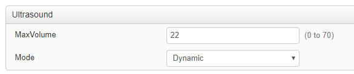

# Step 3

Let's now update the component as the slider is moved.

Restart the [control.js](./control.js) code logic from folder `step3`.
_Make sure to update the connection settings to your device's ip address and credentials in [controls.js](./control.js)_


Move the slider, and check the console for logs showing the request to update the volue

Open your device's admin Web UI to check the value for `Ultrasound MaxVolume` is now set to the latest value displayed in the console.



Alternatively, you can simply restart the Node.js script for the panel to initialize with the current value.

```shell
$ cd step3
$ node control.js
connexion successful
current volume is: 60
updating Ultrasound configuration to: 56
updating Ultrasound configuration to: 41
```