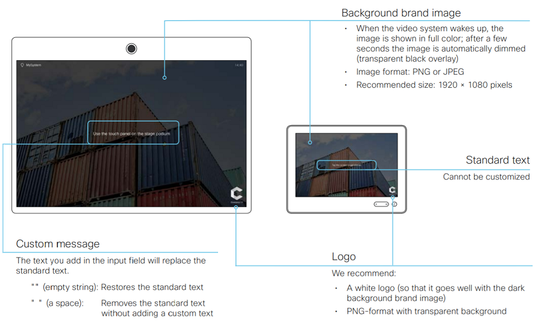

# Personalizing Collaboration Devices from Code

## Objectives

Since version 9.2 of Cisco's Collaboration Endpoint (CE9.2+) software release for its collaboration and telepresence endpoints, on-screen branding, signage and message customization options let you personalize the appearance of the room device and its Touch10 interface.  This capability allows these systems to harmonize with your corporate branding, communicate info to in-room users, update with alerts, and more.  While the admin can always statically configure these custom display options via the room device's web interface, this lab will explore the various ways to use scripts, apps or other automation tools via CE9.2+ xAPI to automate such tasks.

In this lab, you’ll learn to add your own logo and custom message to a Cisco collaboration device from the administration web user interface, and from code: SSH, HTTP/REST and the jsxapi JavaScript package running on Node.js.

 

## Prerequisites

* A Cisco collaboration device with the following requirements:
  * Cisco DX, SX, MX or RoomKit model
  * Running _Cisco TelePresence CE v9.2_ or higher version of software
  * Registered to Cisco Webex Teams, or to an on-premise Cisco Unified Communications Manager (CUCM) or Cisco Video Control Server (VCS)

* Admin credentials to your device, if it's on-premise registered.  If Webex Teams-registered, you'll need admin access to the [Control Hub](https://admin.webex.com/login) of the Cisco Webex Teams organization of your device

* Laptop with local or VPN IP connectivity to your device, and the following software tools, recommended:
  * SSH: Mac/Linux: (built-in); Windows - [Putty](https://www.putty.org/)
  * REST API test client: cross-platform - [Postman](https://www.getpostman.com/)
  * Node.js: 8.x+ [Node.js](https://nodejs.org/en/)

**Finally, we recommend completing the [Introduction to xAPI](https://learninglabs.cisco.com/lab/collab-xapi-intro/step/1) learning lab, as we will assume here that you are familiar with the standard room device web UI, and xAPI programming.**

## About Personalization and Corporate Branding

Branding and customization of the room device 'halfwake' screen lets you upload your own text and images to customize the appearance of the screen and/or the Touch10 control interface.

In the halfwake state, you can:
  * Add a background image (screen/Touch10)
  * Add a small logo image to the bottom right corner (screen/Touch10
  * Customize or remove the default on-screen welcome message (screen only)

  

 

In the 'Awake' state, you can:
  * Add a small logo image to the bottom right corner (screen/Touch10)
  * Add a label or message to the bottom left corner (screen only)

  

 

The features above are accessible with either the 'administrator' or 'integrator' user roles, meaning typical custom apps and scripts can automate personalization for both on-premise (CUCM) and Webex Teams registered devices.

One last remark: be aware that you cannot use the 'branding' feature and a 'custom wallpaper' feature at the same time.

Check the following guides for further details on branding and halfwake customization for Room Kits. Note that DX, SX, and MX series also support the same capabilities as documented in these guides:
  * [page 41 & 42 of the RoomKit  Administrator Guide](https://www.cisco.com/c/dam/en/us/td/docs/telepresence/endpoint/ce92/room-kit-administrator-guide-ce92.pdf)
  * [page 38 & 39 of the RoomKit Plus Administrator Guide]( https://www.cisco.com/c/dam/en/us/td/docs/telepresence/endpoint/ce92/codec-plus-administrator-guide-ce92.pdf)

Now, let’s first experiment with branding and halfwake customization via the regular admin web UI...
