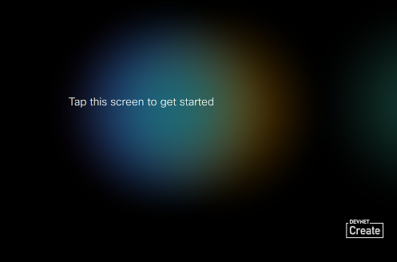

# Personalizing Collaboration Devices from Code

## Objectives

Since version 9.2 of Cisco Collaboration Endpoint software (CE9.2+), Branding and Halfwake customization lets you personalize the appearance of the screen and of the Touch10 interface.

In this lab, you’ll learn to add your own logo signage, and custom messages to your Collaboration device from both the Administration Web User Interface and from code (ssh, HTTP requests and jsxapi).

  

## Pre-requisites

To complete this lab, you need to have a Cisco Collaboration device at hand that:
- supports Cisco TelePresence CE software, typically a DX, SX, MX or RoomKit. Note that moving from Android to CE software can be achevied from upgrade.cisco.com
- is registered to Cisco Spark, to an on-premises CUCM or Expressway

Make sure to be in possession of the 'admin' credentials to your device if it's on-premises registered.
If Spark-registered, you need 'admin' access to the Control Hub of the Cisco Spark organization of your device.

You'll also need a laptop with local IP connectivity to your device, Node.js (in order to run the 'jsxapi' instructions), plus a SSH client and an HTTP client (either curl or Postman).

**Finally, we recommend you have taken the [Introduction to xAPI](https://learninglabs.cisco.com/lab/collab-xapi-intro/step/1) learning lab, as this lab will assume you are familiar with CE customization and xAPI programming.**

## About Personalization and Corporate Branding

Branding and halfwake customization let you upload your own text and images to customize the appearance of the screen and the Touch 10 interface in halfwake and awake states. 

In the Halfwake state you can: 
- add a background brand image to the screen and the Touch 10 interface
- add a small logo in the bottom right corner of the screen and the Touch 10 interface
- customize or remove the message at the center of the screen (only on screen, not on Touch 10)

  

In the Awake state you can: 
-	Add a small logo in the bottom right corner of the screen and the Touch 10 interface
-	Add a label or message in the bottom left corner of the screen (not the Touch 10 interface)

  

These feature are accessible from the administrator and the integrator role, giving you the possibility to customize not only on-premises but also Spark-registered devices.
Moreover, be aware that you cannot use the Branding feature and a Custom Wallpaper at the same time. 

You can check these guides for further details on Branding and Halfwake customization for Room Kits. Note that DX, SX, MX series propose the same capabilities as documented in these guides.
-	[page 41 & 42 of the RoomKit  Administrator Guide](https://www.cisco.com/c/dam/en/us/td/docs/telepresence/endpoint/ce92/room-kit-administrator-guide-ce92.pdf)
-	[page 38 & 39 of the RoomKit Plus Administrator Guide]( https://www.cisco.com/c/dam/en/us/td/docs/telepresence/endpoint/ce92/codec-plus-administrator-guide-ce92.pdf) 

Let’s now experiment Branding and Halfwake customization from the Web UI.
