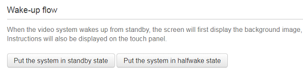
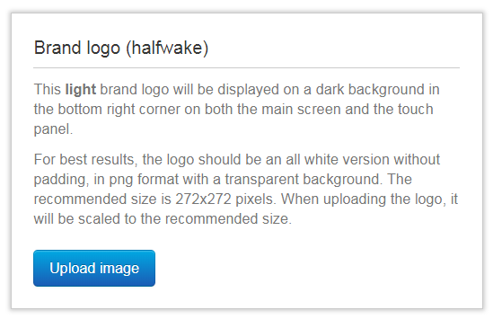
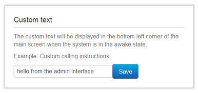
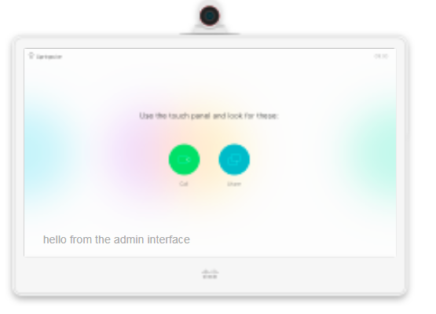

# Step 1: Branding via the Web UI

Before we can learn to automate customizing via code, it will be good to understand how to view and change these settings manually via the device's web interface.

**Let's customze the device's 'standby' state options**

1. Open a web browser pointing to the IP address of your room device, and sign in to the web interface (you will need a user account with 'administrator' or 'integrator' role), and navigate to `Setup > Personalization`

  The **Branding** tab should open by default. From this page you can add/upload your own branding elements (background image, logo, custom message) to the device

2. Scroll down to the **Wake up flow** section to customize the **Halfwake User Experience** settings for your device

3. From here, try clicking the `Standby` and `Halfwake` buttons to change the state of your device.  Notice there is no need to wait minutes for your device to switch to standby mode, or for someone to enter the room for your system to switch to Halfwake state.

  

 

3. Look for the **Brand Logo** section, and click **Upload image**

  

 

4. Select an image file for the logo.  You can download a [sample logo file here](https://learninglabs.cisco.com/posts/files/collab-xapi-branding/assets/images/logo-create-translucide.png), or use your own custom PNG image (best results with transparent background and size of 272 x 272 pixels.)

5. Click **Put the system in Halfwake state** and confirm that your logo is displayed on the screen, as well as your Touch10 (if applicable.)

**Now, let's customize your device when in Awake state**

1. Scroll down the Branding page, and enter a message into the **Custom text** field, such as "Hello from the Web Interface". Click **Save**

  

 

2. Click **Put the system in Awake state** and confirm that your message is displayed in the bottom left corner of the screen

  >Note that the custom message does not display on the Touch10

  

 

**Congrats, you’ve successfully customized your device!**

In the next steps, we will perform the same modifications via code, by invoking your device's embedded xAPI.
