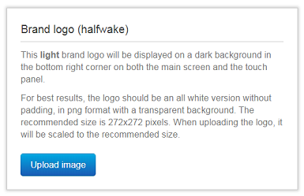

# Step 1: Branding via the Web UI

Sign in to the web interface of your device, and navigate to `Setup > Personalization`.

The `Branding` tab should open by default. From this page you can add your own branding elements (background brand image, logo, custom message) to the video system. 

Scroll down the page to the `Wake up flow` section that lets you customize the Halfwake user experience.

Press the `Standby` and `Halfwake` buttons to modify the current state of your device, with no delay: no need to wait minutes for your device to switch to Standby, nor someone to enter the roomyou’re your system to switch to Halfwake.

  

Look for the `Brand Logo` section, and click upload image.

  

Select the provided logo available at XXX, or a custom PNG image, ideally with transparent background and 272x272 pixels size.

Press the `Put the system in Halfwake state` button and check your logo is displayed on both the screen and Touch 10 (if it applies).

Let's now customize your device when in Awake state.

Scroll down the Branding page, Enter a custom text, such as "Hello from the Web Interface", and click `Save`.

  

Press the `Put the system in Awake state` button and check your message is displayed in the bottom left corner of your screen. Note that the custom message does not display on the Touch10.

  

Congrats, you’ve successfully customized your device. 

In the next steps of this lab, we will perform the same modifications by interacting directly with the xAPI.
