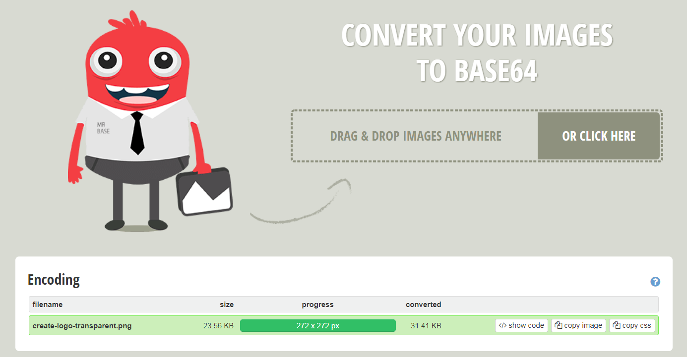
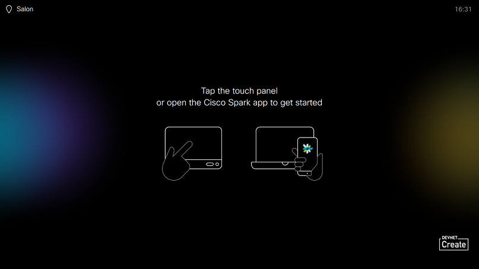

# Step 2: Branding via SSH

In this step, we'll perform the same personalizations as before, by sending commands from your device's 'T-Shell' command line interface, accessible via SSH.

**Updating the onscreen 'awake' text message is easy...**

1. On your PC, open a terminal window and create an SSH session to your device.
For detailed instructions, please refer to [Step 5 of "Introduction to xAPI"](https://developer.cisco.com/learning/lab/collab-xapi-intro/step/5):

    ```Shell
    ssh {room_device_ip} -l {user name}
    ```

    If you've completed the xAPI intro lab, you can use the `integrator` user with `integrator` as password

2.  Once the T-Shell command line interface is ready, enter the command below to update the custom message displayed when the device is active:

    ```shell
    xconfiguration UserInterface CustomMessage: "Hi from ssh"
    ```

    Note that the quotes around the message string are required

3. Make sure your device is in awake state, and confirm that your message is displayed

**Updating the logo for halfwake state takes a bit more work...**

xAPI requires that you provide the _complete, actual image data_ when you send the command to update an image - it doesn't accept a URL or a file location.  As you might expect, it is not really possible to type (or even copy/paste) the entire raw binary image data stream into a SSH session.  However, it is _just_ possible to convert that binary data stream into a (really long) encoded text stream (using Base64 encoding) and paste that it into the session.  

In fact, that's just what we'll do now...  We’ll first use an online tool (thanks to Browserling.com) where we can upload a test image to be Base64 encoded:

1. Open https://www.browserling.com/tools/image-to-base64 in your web browser, and choose/drag+drop a PNG file into the indicated box, and click **Convert**.  You can use [this sample logo  ](https://developer.cisco.com/learning/posts/files/collab-xapi-branding/assets/images/logo-create-translucide.png) if you like:

    

    After a few seconds, the conversion completes and a box full of converted image data is displayed, as above

2. Copy the _entire_ encoded string to your PC's clipboard (**Ctrl+A** / **Ctrl+C** may help)

3. Finally, back in your SSH session, complete the following sequence.  First, type:

    ```shell
    xcommand UserInterface Branding Upload Type: HalfwakeBranding
    ```
  
    **(press Enter)**

    **(paste in the complate encoded image text string from above)**

    **(press Enter)**

    ```Shell
    .
    ```

    (i.e., type a single period by itself)
    
    **(press Enter)**

    This should look a little like the below (notwithstanding a large amount of image data ommitted:)

    ```shell
    xcommand UserInterface Branding Upload Type: HalfwakeBranding
    6L/WX4h5Jn5bhsbhaZQkPSu21/8HecUSKxApm9LH3pyLN333kB5G+LgV7IvPbX1xMHkQT3i98PSbi4G1wcZ[redacted]]saWvtjr38/DZO1POtY2fuB7SSz03rdh2LXkijRI5GHQ1g3cdjjW/gtDQ1tj9RW936V+yD+WtzY/u9+OD4vn6DY/ep7II1y+KN13b/9tOn/lYmpsHbUWaUKR2DOJYCOdJPZU8EFsCRwly/dvdxeLL
    .
    ```

    If the upload completed successfully, you will get an 'OK' response:

    ```shell
    OK
    \*r BrandingUploadResult (status=OK):
    \*\* end
    ```


4. Finally, enter:

    ```shell
    xcommand Standby Halfwake
    ```

    to make your device switch to halfwake mode, where you can confirm that your custom logo is displayed

    
