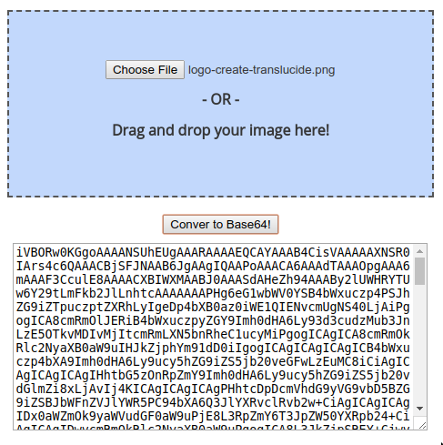

# Step 2: Branding via SSH

We'll now perform the same personalization as in Step 1 but from commands send from your device's t-shell.

From a terminal, open an ssh session to your device. For detailed instructions, please refer to [step 5 of "Introduction to xAPI"](https://learninglabs.cisco.com/lab/collab-xapi-intro/step/5) learning lab.
Connect as admin or integrator, and type the command below to update the custom message displayed when the device is active.

```shell
xconfiguration UserInterface CustomMessage: "Hi from ssh"
```

Updating the logo in Halfwake state takes a bit more of a work. Indeed, the PNG image need to be Base64 encoded, before they can be transferred to your device. We’ll use an online service for the purpose of Base64 encoding the provided image.

Open https://www.base64-image.de/ in a Web browser, and drag the provided image on to the Web page.


<div align="left"></div><br/><br/>


After a few seconds, the conversion completes and a new entry is generated as show above.
Click `show code`, and copy the encoded string starting after `data:image/png;base64,`


<div align="left"></div><br/><br/>


Finally reach back to your device’s ssh session, and type the command below to change the logo displayed in Halfwake mode. Enter the first line, then paste the encoded string, and finally add a `.` character to signal the end of the image bytes to upload.
```shell
xcommand UserInterface Branding Upload Type: HalfwakeBranding
6L/WX4h5Jn5bhsbhaZQkPSu21/8HecUSKxApm9LH3pyLN333kB5G+LgV7IvPbX1xMHkQT3i98PSbi4G1wcZ....................................................................................................................................saWvtjr38/DZO1POtY2fuB7SSz03rdh2LXkijRI5GHQ1g3cdjjW/gtDQ1tj9RW936V+yD+WtzY/u9+OD4vn6DY/ep7II1y+KN13b/9tOn/lYmpsHbUWaUKR2DOJYCOdJPZU8EFsCRwly/dvdxeLL
.

OK
*r BrandingUploadResult (status=OK):
** end
```
If the upload completed successfully, you should get a response from your device as shown above in bold.

Now, type the command below to have the device switch to Halwake, and check your logo shows up.


<div align="left"></div><br/><br/>
