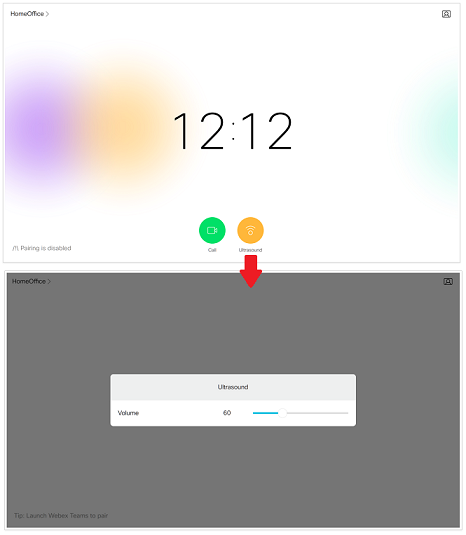
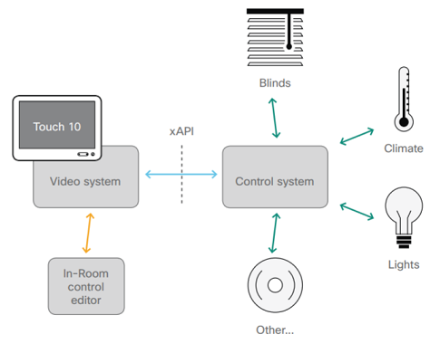

# Creating custom In-Room Controls

## Objectives

In this lab, we’ll explore how to create custom User Interface Controls for Cisco Collaboration Devices.

You’ll first experience what an In-Room Control is from the embedded Simulator, then learn the steps to create an “Ultrasound Panel” with your device’s Controls Editor. 

Then, you'll build a Node.js script to listen to UI events, and update your device's configuration from code.
Finally, if your Collaboration device supports Macros, you will deploy the same code logic to your device.

  

## Pre-requisites

To complete this lab, you need a Cisco Collaboration device (typically a DX, SX, MX or Room Series) that supports Cisco Collaboration software CE9.2 or later. 
_Note that The snapshots for this lab have been created with a DX80 running CE9.3._
Alternatively, you can use one of the [RoomKit Sandboxes](https://devnetsandbox.cisco.com/RM/Diagram/Index/cb9f5c1e-89ab-4716-a8fd-a47296446338?diagramType=Topology) provided for DevNet community members. 

**We recommend you take the [Introduction to xAPI](https://learninglabs.cisco.com/lab/collab-xapi-intro/step/1) learning, as this lab assumes you are familiar with CE customization and xAPI programming.**

If your device is on-premises registered, make sure you are in possession of the 'admin' credentials.
If Spark-registered, 'admin' access to the Control Hub of the Cisco Spark organization of your device is required.

To complete all steps of this lab, you need a laptop with local IP connectivity to your device and the Node.js v6+ runtime. If you need a refresher on JavaScript, we recommend reading [a re-introduction to JavaScript](https://developer.mozilla.org/en-US/docs/Web/JavaScript/A_re-introduction_to_JavaScript).
Moreover, a full featured Javascript integrated development environment is highly desirable to help you run the "to go further" instructions and troubleshoot runtime issues. Check the [Setting up your Javascript IDE](https://learninglabs.cisco.com/tracks/devnet-express-cloud-collab-soft-dev/verify-setup-sd/collab-tools-ide-vscode-sd/step/1) learning lab for detailled guidance to install Visual Studio Code on your laptop.

## Introduction to In-Room Controls

Since Collaboration Endpoint Software CE9.2+, you can add custom user interface elements to Touch10 operated video systems (SX, MX, Room Series), and the user interface of DX Series. 

Such user interface extensions may be in-room controls for lights or blinds, or other peripherals (including one or more video switches to extend the number of video sources available), all controlled by external control systems. 

With In-Room Controls, you will get a consistent user experience throughout the meeting room since both the Cisco video system itself and peripherals are controlled from the same Touch10/DX Series user interface.

  

To learn more about In-Room Controls, check the Customization Guide for the CE version of your device: [CE9.3](https://www.cisco.com/c/dam/en/us/td/docs/telepresence/endpoint/ce93/sx-mx-dx-room-kit-customization-guide-ce93.pdf), [CE9.2](https://www.cisco.com/c/dam/en/us/td/docs/telepresence/endpoint/ce92/sx-mx-dx-room-kit-customization-guide-ce92.pdf).
