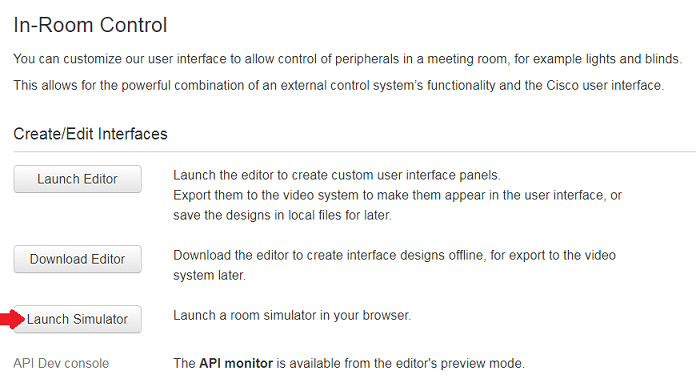
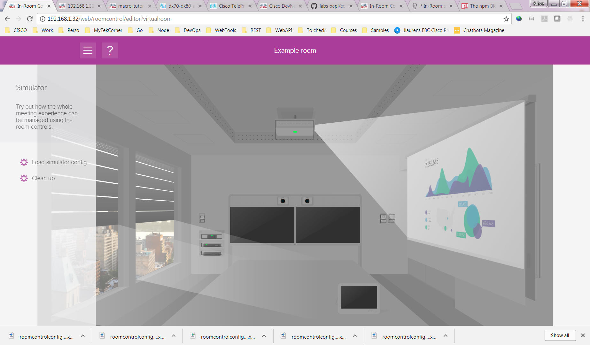
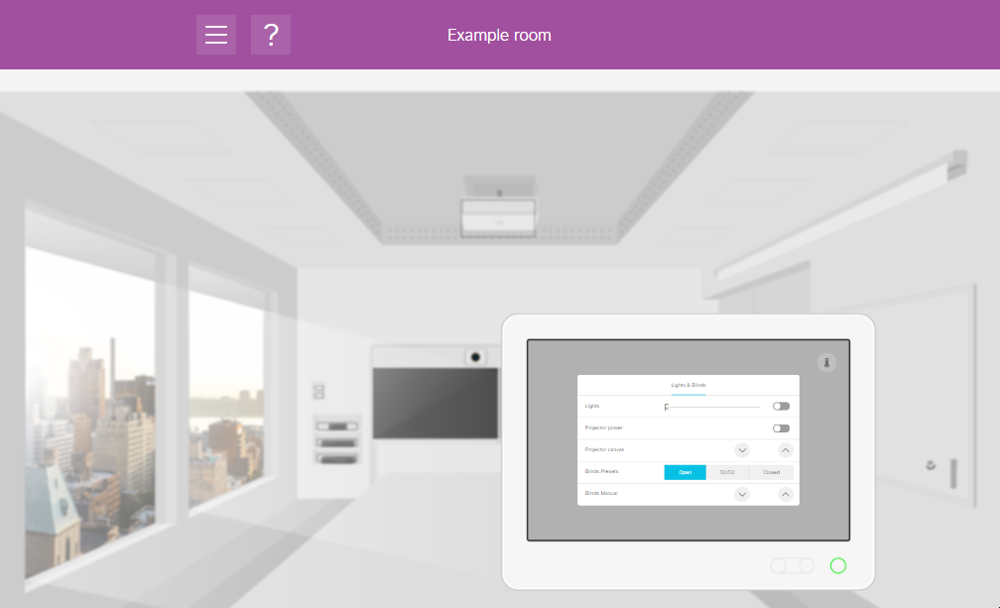
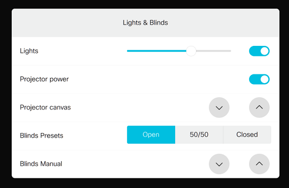

# Step 2: Experience In-Room Controls in the Simulator

To get a feeling for the possibilities offered by custom in-room controls, Webex collaboration devices come with a built-in control simulator that can be run directly from a web browser:

1. Open your device's web management interface, and sign in as a user with either 'integrator' or 'administrator' roles

2. Select the **Integration > In-Room Control** menu entry, and click the **Launch Simulator** button.
  >Tip: open a new web browser tab when doing so

  

  The simulator loads a virtual meeting room, equipped with several automated systems controlled from switches on the walls (and your Touch10/DX interface, as we'll see later in this step.)

  The switch controls let you switch On/Off the projector, interact with the projector canvas, close/open the blinds, etc.

3. Click on the projector to switch it On/Off, and try the switches on the left rear wall to move the blinds Up/Down

  

Pretty cool, isn't it..?

Note that, behind the scenes, this virtual meeting room is in-fact interacting dynamically with your collaboration device through the device's on-board xAPI interface (Cisco's _Collaboration Endpoint_ software API).

**We’ll now load a sample custom control panel on to your device**

The simulator contains a pre-built, default custom in-room control config set that is available when you start the simulator - this control set includes buttons and widgets for manipulating the various 'virtual' systems in the room.  Let's try sending this control set to the actual device:

1. From the left panel, click the **Load simulator config** to deploy the custom panel config set  - and its associated code logic - on to your device

2. Answer **OK** to the 'Export to codec?' dialog. You should see a confirmation message 'Success: Example room loaded'

  Your device's physical Touch10/DX interface should now show a 'Lights & Blinds' activity button

3. If you do not have access to your device's physical Touch10 interface, you can try using the virtual Touch10 shown on-screen in the simulator.  You may need to refresh the browser window to force an update of the virtual Touch10 to reflect the control set upload.  Then click on the virtual Touch10 to bring up the updated control UI - you can click within this mini UI to interact with it
  

4. If not already open, click the 'Lights & Blinds' activity button to open the custom panel that includes controls for lights, projector, etc.

5. In the simulator's virtual meeting room, click on the 'projector' to switch it On/Off

  The 'Projector power' control toggle should change in real time to reflect the status of the virtual projector.

  

  >Note that if you are running the simulation from an admin account, the simulation will work both ways: as you interact with the Touch10/DX interface (physical or virtual), changes will reflect live in the virtual meeting room, and vice versa

6. Once you're done with the simulation, press **Clean up** from the menu/side-panel to restore the original device control set.

For more information about the simulator, you can see _Part 2 - Running the simulator_ of your device’s _Configuration Guide_
