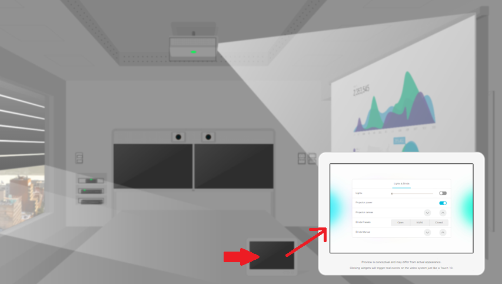

# Step 2: Experience Controls from the Simulator

To get a feeling of the possibilities offered by In-Room Controls, your collaboration device comes with a built-in simulator that can be run straight from a Web browser. 

Open your device's web interface, and sign in with an Integrator or Admin account.

Select the "Integration > In-Room Control" menu entry, and click the "Launch Simulator" button.
Tip: open a new Web Browser tab when doing so.

The simulator loads a virtual meeting room, equipped with several IoT devices controlled from both switches on the walls, and your Touch10/DX interface as we'll see later in this step. 

The IoT controls let you switch on/off the projector, interact with the projector canvas, close the blinds...

Click on the projector to switch it on, and the wall switch on the rear wall to turn the blinds down.

Now, click the Touch 10 interface. A minimized virtual Touch10 appears with a preloaded Climate activity. 

Click outside the activity to access the Touch10's welcome screen, and select the "Lights & Blinds" activity.

Now click the first button to switch on/off the lights. 
The second button lets you interact with the projector's power.

Pretty cool isn't it. 
Well, behind the scene, this virtual meeting room does fully interact with your device through xAPI (Cisco's Collaboration Endpoint software's API).

**We’ll now experience your device xAPI's by loading a custom panel on to your device.**

_Note the activity below cannot be executed from the RoomKit Sandboxes since it requires you to have physical access to a Touch10/DX interface. If you're running the lab with a sandbox'ed device, simply skip to the next step._

From the left pane, click the "Load simulator config" to deploy the custom panel - and its associated code logic - on to your device.

Answer "OK" to the "Export to codec?" dialog. 
You should see a confirmation message "Success: Example room loaded".

Your device's Touch10/DX interface now shows a "Lights & Blinds" activity. 

Click the "Lights & Blinds" activity to open the custom panel that comes with the simulator:

Excellent! You can now interact from your Touch10/DX interface, and watch the interactions happening live in the virtual meeting room.

_If clicking your Touch10/DX interface has no effect on the virtual meeting room, click "Clean up" and try again._

For more information about the Simulator, check "Part 2 - Running the simulator" of your device’s Configuration Guide.
