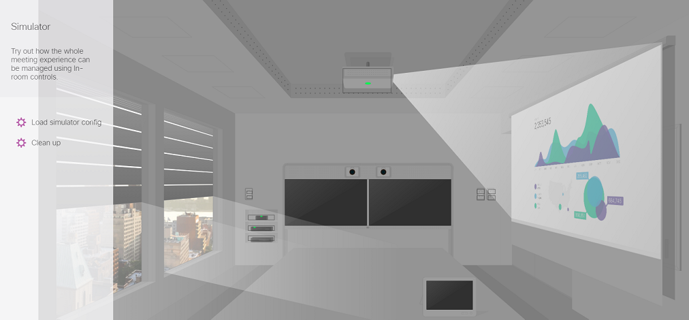

# Step 2: Experience Controls from the Simulator

To get a feeling of the In-Room Controls possibility, your collaboration device comes with a built-in simulator that can be run from your browser. 

Login in to your device's web interface.

Select the "Integration > In-Room Control" menu entry, and click the "Launch Simulator" button (we suggest to open a new Web Browser tab when doing so).

The simulator loads a virtual meeting room, equipped with several IoT devices controlled from both switches on the walls, and your Touch10/DX interface. The IoT controls let you switch the projector, interact with the projector canvas, close the blinds…

Click on the projector to switch it on, and the wall switch on the rear wall to turn the blinds down.

Now, click the Touch 10 interface. A minimized virtual Touch10 appears with a preloaded Climate activity. 

Click outside the activity to access the Touch10 welcome screen, and select the "Lights & Blinds" activity.

Now click the first button to switch on/off the lights. 
The second button lets you interact with the project.

Pretty cool isn’t it. 
Well behind the scene, this virtual room is capable to fully interact with your device through its programmable API – xAPI.
We’ll now experience this by loading a custom control Panel on your device.

_Note the next activity won't be possible from a DevNet Sandbox since it requires you to have physical access to a Touch10/DX interface. If you're running the lab from the sandbox, simply skip to the next step of this lab._

From the left pane, click the "Load simulator config" to deploy the custom panel and its associated code logic, on to your device.

Answer "OK" to the "Export to codec?" dialog. 
You should see a confirmation message "Success: Example room loaded".

Your device's Touch10/DX interface now shows a "Lights & Blinds" activity. 

Click it to display the custom panel proposed for this simulation.

Now interact from your Touch10/DX interface, and watch the interactions happening live in the virtual meeting room.

_If the interactions are not happening live in the meeting room as you click your Touch10/DX interface, click "Clean up" and try interacting to your Touch10/DX interface again._

For more information about the Simulator, check "Part 2 - Running the simulator" of your device’s Configuration Guide.
