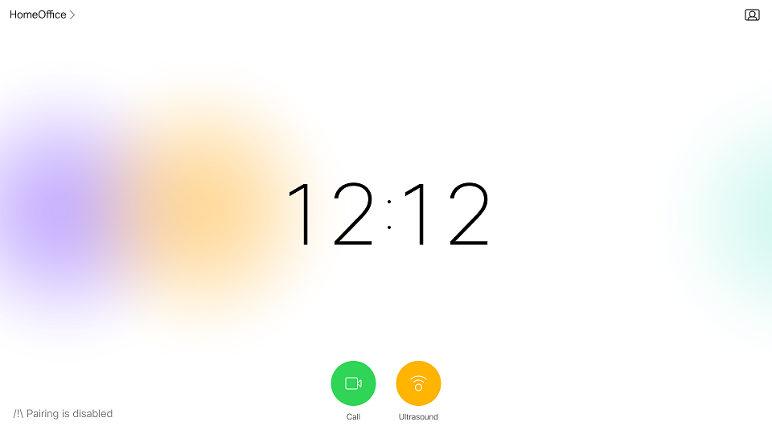

# Step 3: Creating custom In-Room Controls

You will now learn how to build a custom In-Room Control panel end-to-end, and deploy it to your device. 
In the next steps of this lab, we will go through the steps to make this panel interacting with external systems and your actual device's actual configuration.

> For the purpose of this lab, we will create an Ultrasound panel to control the volume of the Proximity Pairing capability of your device. 
> This option is not proposed by your device’s default Touch10/DX interface. 
> Moreover, the Ultrasound configuration is fully accessible via the xAPI and an integrator role account. 
> One final note: the Ultrasound volume let you control the ability to pair with Webex Teams clients for Webex-registered devices, or via Proximity for VCS / CUCM registered devices.

From the Web interface of your device, click the “Integration > In-Room Control” menu entry, and click the "Launch Editor"'s button.

As the editor opens for the first time, you would get an invite to create your first Panel. Before doing, note the series of buttons in the top right corner. We’ll use them through this lab in order to 
1.	Pre-visualize the panels in your Web browser
2.	Export the panels to your device
3.	Menu entries to import, export, merge, access help.

We will now create our Ultrasound panel.

Click the '+' button located in the left pane to insert a new Panel:

Update the panel name from "Panel" to "Ultrasound" by double-clicking `Panel`.

_Note that the In-Room Control Editor that comes with CE9.2.1 does not let you add Colors, edit by double-clicking, but will let you perform most of the instructions in this lab._

Modify your panel’s properties
- Is available: choose “Only out of call”
- Icon: pick the proximity icon
- Color: yellow was picked for the instructions of this lab

**Great! Let’s now populate our panel with UI components.**

Drag and drop widgets from the "Widgets" tab in the right pane. 

Drop a "Slider", then a  "Text" widget to the left of the slider.
Change the titles for the panel and the row, by double clicking on the labels, as in the example below:

Also change "Text" to "?".

Now change the identifiers of the widgets from 'widget_1' and 'widget_2' to 'volume_text' and 'volume_slider'.
These identifiers will be used in our code to reference the various widgets.

**Congrats, you’re now ready to deploy your component.**

Click the "Export configuration" button, among the top right entries.

Reach to your device’s Touch10/DX interface and check the "Ultrasound" activity is now proposed!

Click the "Ultrasound" activity to make your panel show up!

So static! 
No worries: in the next steps of this lab, we’ll bring more interactivity to your panel.
