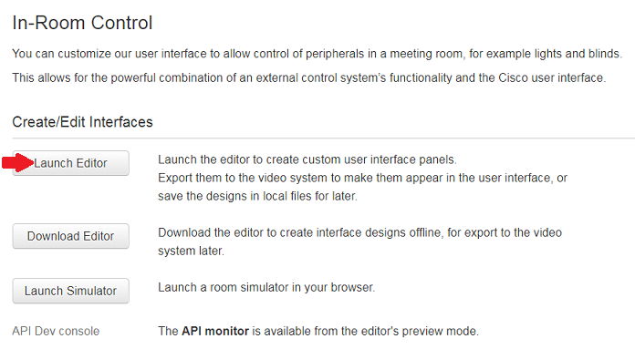
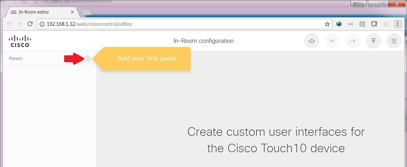
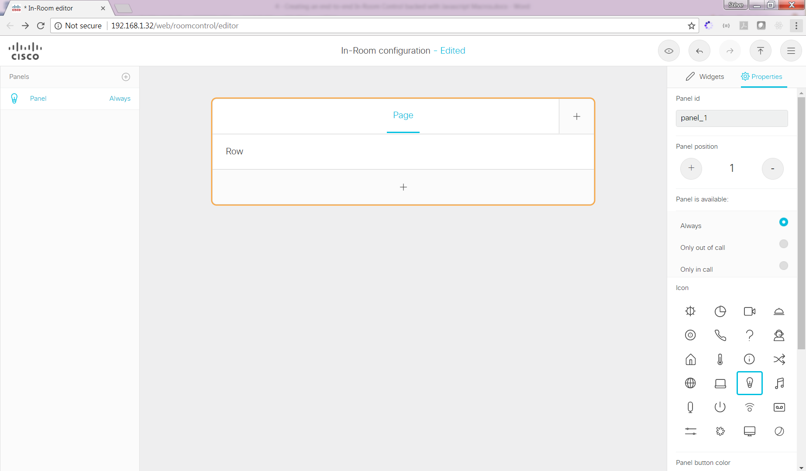
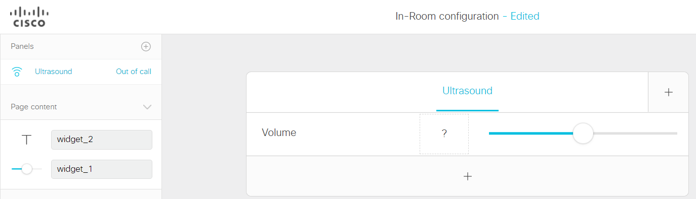
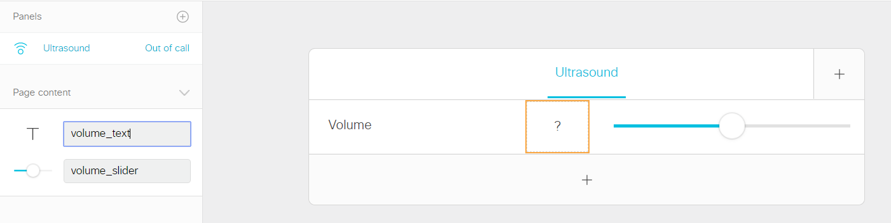
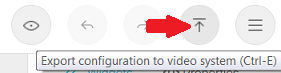
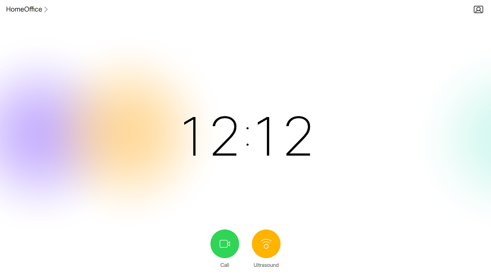

# Step 3: Creating custom In-Room Controls

You will now learn how to build a custom In-Room Control panel end-to-end, and deploy it to your device. 

> For the purpose of this lab, we will create an Ultrasound panel to control the volume of the Proximity Pairing capability of your device. Here is some background info if you are new to Ultrasound:
> - the "Ultrasound MaxVolume" configuration setting lets you control the ability to pair with your device,
> - controlling the Ultrasound volume is not proposed by default from the Touch10/DX interface,
> - configuring Ultrasound is accessible from the 'Integrator' role,
> - in terms of terminology, Webex Teams Pairing is the term used for Webex-registered devices, whereas Proximity pairing applies to on-premises VCS or CUCM registered devices.

From the Web interface of your device, click the “Integration > In-Room Control” menu entry, and click the "Launch Editor" button:

As the editor opens, you get an invite to create your first 'Panel'.
Before doing so, note the series of buttons in the top right corner. They let you:
1. pre-visualize from in your Web browser,
2. export the panels to your device,
3. but also import, export, merge files and access help.

**We will now create a brand new 'Ultrasound' panel**

Click the '+' button located in the left pane:

Update the panel name from "Panel" to "Ultrasound" by double-clicking `Panel`.

_Note that the In-Room Control Editor that comes with CE9.2.1 does not let you perform edits by double-clicking but through the properties located in the right pane._

Proceed by modifying the following properties for your panel:
- Panel's location: change from "Is available" to "Only out of call"
- Activity's Icon: pick the "Proximity" icon among the proposed list of icons
- Activity's Color: yellow was picked for the rest of the instructions. _Note that choosing a color is proposed for CE9.3+_

**Great! Let’s now populate our panel with UI components.**

Drag and drop widgets from the "Widgets" tab in the right pane:
- drop a "Slider", then a  "Text" widget to the left of the slider.
- change the titles for the panel and the row, by double clicking on the labels.
- also change the "Text" label to "?" 

Now change the identifiers of the widgets from 'widget_1' and 'widget_2' to 'volume_text' and 'volume_slider'.
_These identifiers will be used in the next steps of this lab in order to reference the various widgets from code._

**Congrats, you’re now ready to deploy your component.**

Click the "Export configuration" button, among the top right entries.

Reach to your device’s Touch10/DX interface and check the "Ultrasound" activity is now proposed!

Click the "Ultrasound" activity to make your panel show up!

Awesome. However it's not interactive yet..
No worries. In the next steps of this lab, we’ll add interactivity to your panel through custom code.
