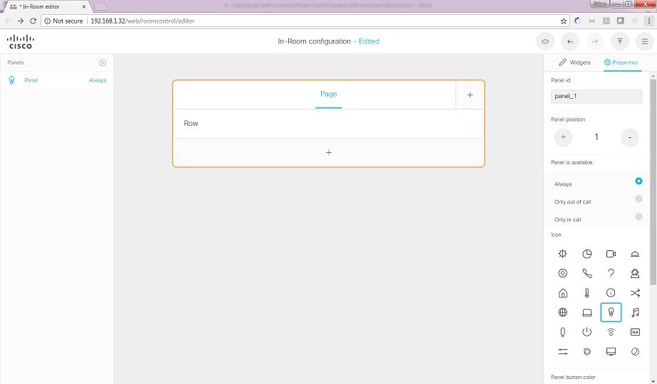
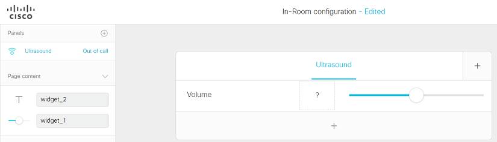

# Step 3: Creating Custom In-Room Controls

You will now learn how to build a custom in-room control panel end-to-end, then deploy it to your device.  This control panel will allow the Touch10 or DX user to control the device's ultrasound pairing features via a custom in-room control set.

The use-case might be environments where room and/or desktop collaboration devices may frequently be close together, or even in the same room (such as a demo or training lab!).  It may be desireable to provide an easy way for end-users to disable or attenuate the ultrasound features of individual devices to avoid clients continuously trying to pair with multiple devices.

> Some background info if you are new to Webex device ultrasound features:
> - The "Ultrasound MaxVolume" configuration setting lets you control the ability to pair with your device - either via the Webex Teams client (cloud) or the Cisco Proximity app (on-premise)
> - Controlling the ultrasound volume is not an option in the default control set on the Touch10/DX interface - it must normally be done via the web management interface by an admin/integrator user
> - Configuring ultrasound is possible using xAPI via the 'integrator' or 'administrator' roles

1. From the web interface of your device, click the **Integration > In-Room Control** menu entry, and click the **Launch Editor** button:

  

As the editor opens, you are invited to create your first 'Panel'.
Before doing so, note the series of buttons in the top right corner. They let you:
  * Pre-visualize the panel in your Web browser
  * Export the panels to your device
  * Import/export/merge control config files
  * Access help
  

**We will now create a brand new 'Ultrasound' panel**

1. Click the **+** button located in the left pane:

  

2. If given the option for 'Where should the panel be available', chooes **Home screen**

3. Update the panel name from 'Panel' to 'Ultrasound' by double-clicking `Panel`

  >Note that the In-Room Control Editor that comes with CE9.2.1 does not let you perform edits by double-clicking but through the properties located in the right pane.

4. Go ahead and modify the following properties for your panel:
  * Panel's location: change to 'Home' (or 'Only out of call')
  * Activity icon: pick an icon, e.g. 'Microphone' (or 'Proximity')
  * Activity's color (if available): yellow

  >Note, some editor versions may have different options for the above items

**Great! Let’s now populate our new panel with some UI components**

1. Drag-and-drop these widgets from the **Widgets** tab in the right pane:
  - Drop a 'Slider' onto the right side of the 'Row' area
  - Then, just to the left of the slider, drop a  'Text' widget
  - Change the 'Row' label to 'Volume'
  - Change the 'Text' label to '?'

  

2. Switching back to the **Properties** tab, change the 'Widget id'/identifiers of the widgets from 'widget_1' and 'widget_2' to 'volume_text' and 'volume_slider' respectively:

  
  >These identifiers will be used in the next steps of this lab in order to reference the various widgets from code

  **Congrats, you’re now ready to deploy your component.**

3. Click the "Export configuration" button, among the top right entries.

  

  Check your device’s Touch10/DX interface and confirm that you see a new "Ultrasound" activity displayed:

  
  >If viewing via the simulator, be sure and refresh the page

4. Click the **Ultrasound** activity to make your panel show up!

Awesome! However, note that your new activity is not interactive yet..

No worries. In the next steps of this lab, we’ll add interactivity to your panel through custom code.
