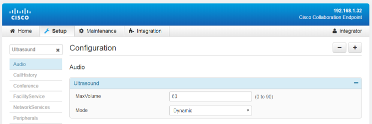
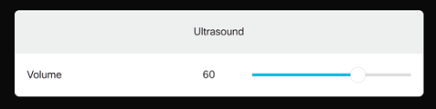

# Step 4: Interacting with your Controls from Code

In this step, you'll learn to interact - from code - with In-Rooms controls such as the Text and Slider widgets we placed earlier.
For that purpose, you will create a Node.js script on your local machine, and leverage the jsxapi library - the Node.js wrapper for CE xAPI - as detailled in [step 7 of the Introduction to xAPI and Cisco CE Software Customization]( https://learninglabs.cisco.com/lab/collab-xapi-intro/step/7) learning lab.

Open a terminal, and type the commands below to create a new folder, and install the `jsxapi` library:

```shell
$ mkdir controls
$ cd controls
$ npm install jsxapi
```

Then create a file named 'control.js' with the [contents below](https://github.com/CiscoDevNet/labs-xapi/blob/master/code/collab-xapi-controls/step1/control.js):

_Make sure to place your device's ip-address on line 2, and your account credentials on lines 3 and 4_

```javascript
const jsxapi = require('jsxapi')
const xapi = jsxapi.connect("ssh://192.168.1.32", {
    username: 'integrator',
    password: 'integrator'
})

xapi.on('error', (err) => {
    console.error(`connexion failed: ${err}, exiting`);
    process.exit(1);
})

xapi.on('ready', () => {
    console.log("connexion successful")

    // Display current Ultrasound volume
    xapi.config.get('Audio Ultrasound MaxVolume')
        .then((volume) => {
            console.log(`current volume is: ${volume}`)

            // Ending script
            xapi.close()
        })
})
```

Line 12 and after, the connection has been successfully established to the device. 
The code then read the current configuration setting for Ultrasound volume.

Now, launch your script from the same folder where you installed the jsxapi module, by typing the command below:

_If you get a client-timeout, check the ip address in your code is correct, and that the ssh protocol is activated for your device._

```shell
$ node control.js
connexion successful
current volume is: 60
```

The value for “current volume” displayed in the console corresponds to the value of the `Audio > Ultrasound MaxVolume` setting in your device’s configuration.




_Note that the range of the `Ultrasound MaxVolume` configuration settting varies among Cisco Collaboration Devices. It is typically 0 to 90 for a DX80, and 0 to 70 for a RoomKit. Our code will take care of this subtle difference among devices in the upcoming instructions of the lab._

**Great! Your code is now ready to be extended in order to initialize the Text and Slider widgets of your panel.**

Replace the `.on(‘ready’)` section of your Node.js script with the [contents below](https://github.com/CiscoDevNet/labs-xapi/blob/master/code/collab-xapi-controls/step2/control.js):

_Note that if you own a Room device series, simply modify the `MAX` value to 70 in the source code._

```javascript
// CE maximum value for Ultrasound's MaxVolume
const MAX = 90 // for a DX80, and 70 for a RoomKit

xapi.on('ready', () => {
    console.log("connexion successful")

    // Initialize Widgets with current volume
    xapi.config.get('Audio Ultrasound MaxVolume')
        .then((volume) => {
            console.log(`current volume is: ${volume}`)

            xapi.command('UserInterface Extensions Widget SetValue', {
                WidgetId: 'volume_text',
                Value: volume
            })

            // CE maximum value for Ultrasound's MaxVolume
            const level = Math.round(parseInt(volume) * 255 / MAX)
            xapi.command('UserInterface Extensions Widget SetValue', {
                WidgetId: 'volume_slider',
                Value: level
            })
        })
        .catch((err) => {
            console.log(`could not fetch volume: ${err.message}`)
        })
})
```

On line 12, we are setting a value to the "Text" widget whose identifier is `volume_text` as defined in the previous step of this lab through the "In-Room Controls Editor".

On line 19, we are setting a value to the "Slider" widget. _Note that we are mapping a volume value in range 0-90 for a DX10, to the 'Slider' widget's range of 0-255 through the function `Math.round(parseInt(volume) * 255 / MAX)`. 

Launch the script and check that the Ultrasound panel properly initializes with your devicess current "Ultrasound MaxVolume" configuration setting.


