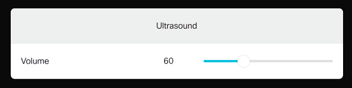
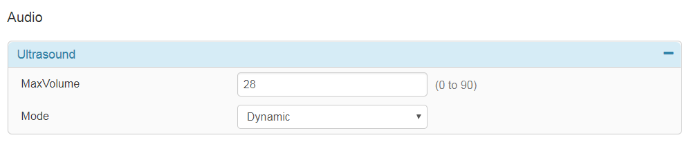

# Step 5: Updating the Device Configuration

The panel created in the previous steps of this lab is pretty static for now. Yet, under the covers, xAPI events do fire every time you interact with the 'Slider' widget: moving the slider to the left, to the right, pressing, releasing buttons, etc.

Bringing interactivity to a control panel happens by adding custom code logic that responds to these events.

Let's add that functionality to the code...

1. Update your script by appending the extra lines below:

  ```javascript
  // Update configuration from UI actions
  xapi.event.on('UserInterface Extensions Widget Action', (event) => {
      if (event.WidgetId !== 'volume_slider') return
      if (event.Type !== 'changed') return

      // Update Ultrasound configuration
      const volume = Math.round(parseInt(event.Value) * MAX / 255)
      console.log(`updating Ultrasound configuration to: ${volume}`)
      xapi.config.set('Audio Ultrasound MaxVolume', volume)
  })
  ```
Let's inspect this code:
  * The `xapi.event.on('UserInterface Extensions Widget Action')` instruction registers your code to listen to events fired by the widgets of all custom in-room controls deployed on your device
  * The two next lines check for `event.WidgetId` and `event.Type` in order to filter out all events except the state `changed` event of the `volume_slider` widget
  * As seen previously (though this time in reverse), the instruction `Math.round(parseInt(event.Value) * MAX / 255)` transform the slider's current value (range 0-255) to an 'Ultrasound MaxVolume' value suitable for your device's range
  * Finally, the 'Ultrasound MaxVolume' configuration setting of your device is updated thanks to the `xapi.config.set()` method

2. Now, restart your script, and move your panel's slider around

  

  As you move the slider, you’ll see events flying in the console:

  ```shell
  connexion successful
  current volume is: 60
  updating Ultrasound configuration to: 58
  updating Ultrasound configuration to: 46
  updating Ultrasound configuration to: 39
  updating Ultrasound configuration to: 38
  updating Ultrasound configuration to: 28
  ```

  In the device web management UI, check that the value for 'Ultrasound MaxVolume' under **Setup -> Audio** reflects the setting as updated by your script:

  
  >Note: you may need to refresh the web UI page in order to view the latest current value

Excellent! But as you may have noticed, the 'Text' widget does not update...(yet!)

We will fix that in the next step of the lab.
