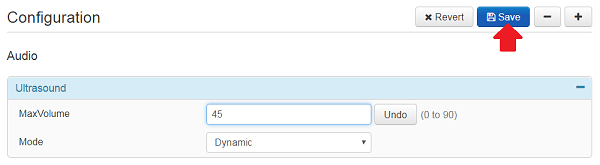

# Step 6: Reflecting State Both Ways	

In the previous steps, you created a script that initializes an Ultrasound panel, then updated the script to reflect the actions performed through the widget down to your device's configuration in step 5. These interactions are reflected in black and red in the figure below:


For the refresh cycle to be complete, we will now listen to the changes happening at the device's configuration level, and reflect these changes up to the widgets, so that the widgets and your device's state can stay in sync - as highlighted in green in the figure above.


**Update the [control.js script](https://github.com/CiscoDevNet/labs-xapi/blob/master/code/collab-xapi-controls/step4/control.js) with the contents below:**

```javascript
// CE maximum volume for Ultrasound
const MAX = 90 // for a DX, 70 for a RoomKit

xapi.on('ready', () => {
    console.log("connexion successful")

    // Initialize Widgets with current volume
    xapi.config.get('Audio Ultrasound MaxVolume').then(updateUI)

    // Update configuration from UI actions
    xapi.event.on('UserInterface Extensions Widget Action', (event) => {
        if (event.WidgetId !== 'volume_slider') return
        if (event.Type !== 'changed') return

        // Update Ultrasound configuration
        const volume = Math.round(parseInt(event.Value) * MAX / 255);
        console.log(`updating Ultrasound configuration to: ${volume}`)
        xapi.config.set('Audio Ultrasound MaxVolume', volume)
    })

    // Update UI from configuration changes
    xapi.config.on('Audio Ultrasound MaxVolume', updateUI)
})

function updateUI(volume) {
    console.log(`updating UI to new Ultrasound configuration: ${volume}`)

    // Update text
    xapi.command('UserInterface Extensions Widget SetValue', {
        WidgetId: 'volume_text',
        Value: volume
    })

    // Update slider 
    const level = Math.round(parseInt(volume) * 255 / MAX)
    xapi.command('UserInterface Extensions Widget SetValue', {
        WidgetId: 'volume_slider',
        Value: level
    })
}
```

Note that the code that updates the 'Text' and 'Slider' widgets has been extracted and placed in the `function updateUI(volume)` where both widgets are updated with the specified volume parameter.

The code logic turns out to be much simpler with the function `updateUI`to be invoked twice:
- at launch as `xapi.config.get` is invoked, 
- and by the `xapi.config.on` instruction which fires as configuration changes happen.

Now, restart your Node.js script, and interact from both the "Ultrasound" panel and the Configuration settings of your device:




In both cases, the changes reflect to the Touch10/DX interface, and your device: the bi-directional refresh loop is operational!


