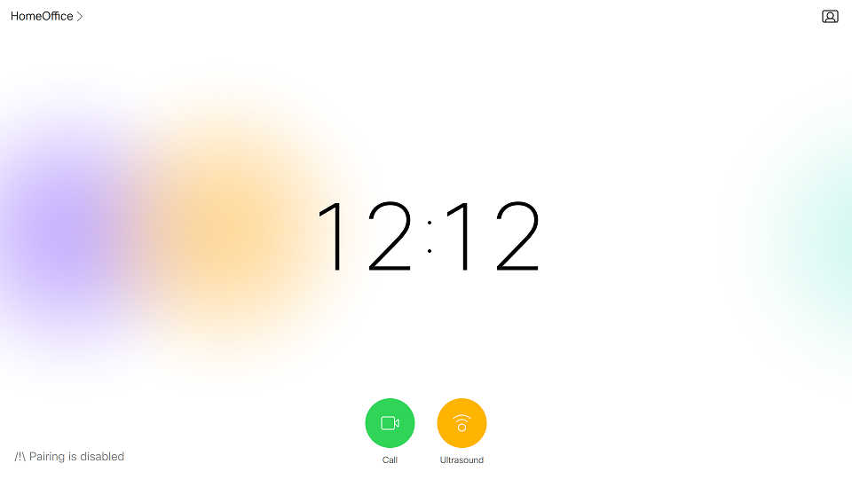

# Step 7: Extra Events to Consider

In this step, we will perform a few tricks to make your custom In-Room Controls panel shine.

To start with, there is one extra event that is worth considering: as you export new versions of the "Ultrasound" panel to your device, you will certainly want the panel to initialize right away, with no need to restart your `control.js` script.

This can be implemented by listening to the `UserInterface Extensions Widget LayoutUpdated` event as proposed on line 23 of the [control.js script](https://github.com/CiscoDevNet/labs-xapi/blob/master/code/collab-xapi-controls/step5/control.js) below:

```javascript
xapi.on('ready', () => {
    console.log("connexion successful")

    // Initialize the widgets
    xapi.config.get('Audio Ultrasound MaxVolume')
        .then(updateUI)

    // Update configuration from UI actions
    xapi.event.on('UserInterface Extensions Widget Action', (event) => {
        if (event.WidgetId !== 'volume_slider') return
        if (event.Type !== 'changed') return

        // Update Ultrasound configuration
        const volume = Math.round(parseInt(event.Value) * MAX / 255);
        console.log(`updating Ultrasound configuration to: ${volume}`)
        xapi.config.set('Audio Ultrasound MaxVolume', volume)
    })

    // Update UI from configuration changes
    xapi.config.on('Audio Ultrasound MaxVolume', updateUI)

    // Initialize the widgets also as the controls are deployed
    xapi.event.on('UserInterface Extensions Widget LayoutUpdated', (event) => {
        console.log(`layout updated, let's refresh the widgets`)
        xapi.config.get('Audio Ultrasound MaxVolume')
            .then(updateUI)
    });
})
```

One last customization.
As the Ultrasound volume gets close to zero, we would want to display a message to warn users that pairing is not enabled for the device any more. 
On the contrary, when pairing is possible, we want to invite users to pair from their Webex Teams app or Proximity client. 

Change the `updateUI()` function of the [control.js script](https://github.com/CiscoDevNet/labs-xapi/blob/master/code/collab-xapi-controls/step6/control.js) with the contents below:

```javascript
function updateUI(volume) {
    console.log(`updating UI to new Ultrasound configuration: ${volume}`)

    // Update text
    xapi.command('UserInterface Extensions Widget SetValue', {
        WidgetId: 'volume_text',
        Value: volume
    })
        .then(() => {
            // Update custom message
            let newVolume = parseInt(volume)
            if (newVolume <= 5) {
                xapi.config.set('UserInterface CustomMessage', "/!\\ Pairing is disabled")
                return
            }

            // Pick the message that suits your device's registration mode
            // If spark-registered
            xapi.config.set('UserInterface CustomMessage', "Tip: Launch Webex Teams to pair")
            // If VCS or CUCM registered
            //xapi.config.set('UserInterface CustomMessage', "Tip: pair with me from a Proximity client")
        })

    // Update slider 
    const level = Math.round(parseInt(volume) * 255 / MAX)
    xapi.command('UserInterface Extensions Widget SetValue', {
        WidgetId: 'volume_slider',
        Value: level
    })
}
```

Restart your Node.js script, and turn the Ultrasound volume to zero from the panel's slider.
Look at the lower left corner for the updated custom message.




If you are interested to dig into the details of your device's branding capabilities, check the [Personalizing Collaboration Devices from Code](https://learninglabs.cisco.com/lab/collab-xapi-branding/step/1) learning lab.
