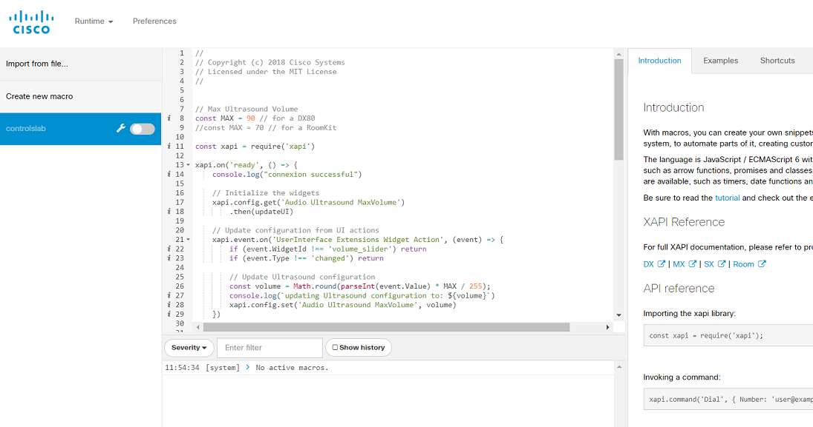
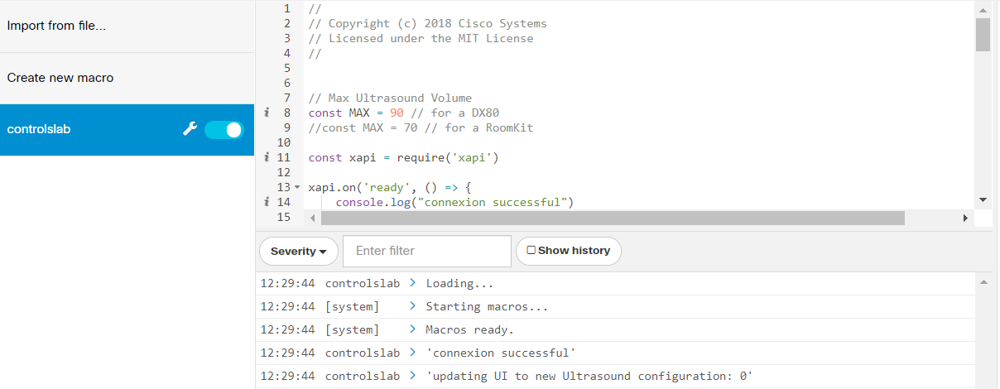
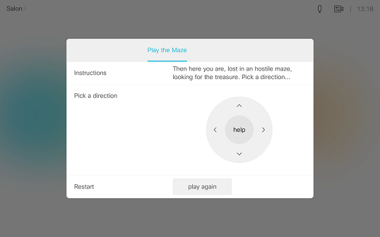

# Step 8: Creating On-Board JavaScript Macros

>Note that this step requires that your application user have the 'administrator' role ('integrator' is not sufficient).  Macros are not supported on cloud-registered devices or any SX10 device.

In the previous steps, we brought interactivity to a custom in-room control panel by leveraging the xAPI via a script running on your PC.  Of course, keeping your PC powered on and connected to the local network continuously is not going to work in production!  You could deploy an application server on-site with your device to host the script, however there may be a better option...

CE v9.2.1+ gives you the possibility to deploy custom code to the device itself via the 'macro' feature.  Essentially, this feature allows JavaScript code to be uploaded and run directly on the collaboration device (hosted in a secure 'sandbox' environment).  This custom code can interact with the device using the exposed `xapi` JavaScript object, just as we experienced earlier with the jsxapi library.  

Ideally, code developed on an external app server using jsxapi could be uploaded to run directly on a collaboration device without requiring an external host.

>Note: for security and performance reasons, the macro run-time environment does not support establishing any kind of remote network connections via the JavaScript code.  You can learn more about macros in [Part 4 of CE’s Customization Guide](https://www.cisco.com/c/dam/en/us/td/docs/telepresence/endpoint/ce93/sx-mx-dx-room-kit-customization-guide-ce93.pdf)

**Let's see how we can run our previously developed script on-board our device using a macro**

1. Sign in to your device's web interface (as a user with 'administrator' role) and navigate to the **Integration -> Macro Editor** menu

2. The first time the Macro Editor is launched, you are asked to authorize the use of macros

  Click **Yes, enable Macros**

3. As the Macros dashboard opens, look for the left pane that helps manage the macros deployed on your device: and rename it `controlslab`.

  

  Click **Create a new macro**

4. Copy and paste in the full contents of your Node.js script so far

5. Remove the first 5 lines of the script, replacing with the simple reference below:
  ```javascript
  const xapi = require('xapi');
  ```

6. Save your macro and rename it to `controls-lab`

7. Make sure the script that was running on your PC in the previous steps is stopped (**Ctrl + C** if needed), then launch your macro by clicking the toggle on its right as show below:

  

Interact once more with your custom ultrasound panel to confirm everything is working as expected, and observe the logs flying in the Macro Editor console.

**Congrats! Your macro is up and running**

## Going Further

Take some time to explore the various resources provided in the Macro Editor towards the right.

You’ll find several tabs with useful links:
- **Introduction**: this tab contains handy code snippets demonstrating how to invoke commands, listen to events and update configuration settings
- **Examples**: these scripts are organized by use-case, are fully operational, and can be experimentd with immediately by clicking the **Load Example** button
- **Tutorial**: this guide is an excellent walk-through to help you in your first steps with the macro framework (the guide is also available online here [CE 9.2.1+ Macros Tutorial](https://github.com/ObjectIsAdvantag/xapi-samples/blob/master/macros/pdf/macro-tutorial.pdf).

To inspire you, we’ve assembled a collection of custom in-room control definition files, macros and Node.js example scripts in this [xAPI samples repo](https://github.com/ObjectIsAdvantag/xapi-samples).

For fun, you might like trying out the xAPI-based [Maze game](https://github.com/ObjectIsAdvantag/xapi-samples/tree/master/controls/levels)!


