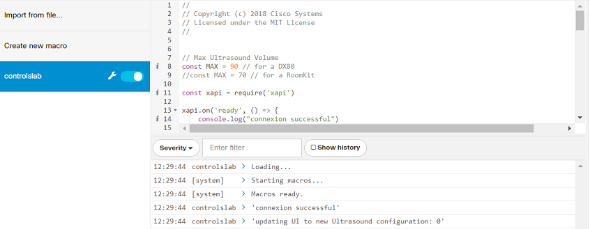

# Step 8: Running JavaScript on-device with macros

>Note that this step requires that you can connect to your CE device with an 'administrator' role; 'integrator' role is not authorized to run Macros.

In the previous steps, we brought interactivity to a custom in-room control panel by leveraging the xAPI via a script running on your PC.  Of course, keeping your PC powered on and connected to the local network continuously is not going to work in production!  You could deploy an application server on-site with your device to host the script, however there may be a better option...

CE v9.2.1+ gives you the possibility to deploy custom code to the device itself via the 'macro' feature.  Essentially, this feature allows JavaScript code to be uploaded and run directly on the collaboration device (hosted in a secure 'sandbox' environment).  This custom code can interact with the device using the exposed `xapi` JavaScript object, just as we experienced earlier with the jsxapi module.  

Ideally, code developed on an external app server using jsxapi could be uploaded to run directly on a collaboration device without requiring an external server.  Though, note the macro JavaScript environment has some limitations, including the lack of local file storage, the inability to install additional JavaScript packages via NPM, and restrictions on establishing network connections.

You can learn more about macros in [Part 4 of CE’s Customization Guide](https://www.cisco.com/c/dam/en/us/td/docs/telepresence/endpoint/ce96/sx-mx-dx-room-kit-customization-guide-ce96.pdf)

**Let's see how we can run our previously developed script on-board our device using a macro**

1. Sign in to your device's web interface _(as a user with 'administrator' role)_ and navigate to the **Integration** > **Macro Editor** menu

2. The first time the Macro Editor is launched, you are asked to authorize the use of macros

    Click **Yes, enable Macros**

3. As the Macros dashboard opens, look for the left panel that helps manage the macros deployed on your device:

    

    Click **Create a new macro**

4. Copy and paste in the full contents of your Node.js script so far

5. Remove the first 5 lines of the script, replacing with the simplified reference below:

    ```javascript
    const xapi = require('xapi');
    ```

6. Save your macro and rename it to `controls-lab`

7. Make sure the script that was running on your PC in the previous steps is stopped (**Ctrl + C** if needed), then launch your macro by clicking the toggle shown below:

    

Interact once more with your custom ultrasound panel to confirm everything is working as expected, and observe the logs flying in the Macro Editor console.

**Congrats! Your macro is up and running**

## Going Further

There is much more to learn about the possibilities of JavaScript macros!  We definitely recommend you try the [Exploring xAPI Macros for Cisco collaboration devices](https://developer.cisco.com/learning/lab/collab-xapi-macros/step/1) lab if your're interested...


To inspire you, we’ve assembled a collection of custom in-room control definition files, macros and Node.js example scripts in this [xAPI samples repo](https://github.com/ObjectIsAdvantag/xapi-samples).

For fun, you might like trying out the xAPI-based [Maze game](https://github.com/ObjectIsAdvantag/xapi-samples/tree/master/controls/maze_levels)

