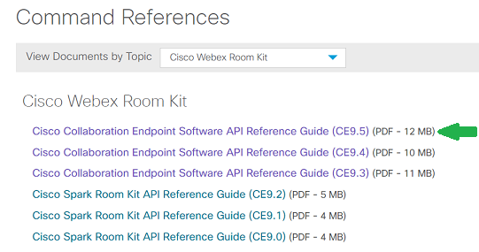

# Introduction to xAPI for Cisco Room Devices

## Objectives

Throughout this lab, we’ll explore the programmability of Cisco collaboration room devices.

You’ll learn about xAPI – the API exposed by the [Cisco TelePresence CE9 software](https://www.cisco.com/c/dam/en/us/td/docs/telepresence/endpoint/software/ce9/release-notes/ce-software-release-notes-ce9.pdf), and how to invoke the API from SSH and HTTP.

To make it concrete, we’ll illustrate xAPI and room device customization by showing how to configure your device and start video calls, for both Webex Teams- and on-premise-registered devices.

>Note: Cisco Spark is now Cisco Webex Teams

## Prerequisites

* A Cisco collaboration device with the following requirements:
  - Cisco DX, SX, MX or RoomKit model
  - Running the _Cisco TelePresence CE v9_ version of software
  - Registered to Cisco Webex Teams, or to an on-premise Cisco Unified Communications Manager (CUCM) or Cisco Video Control Server (VCS)

* Admin credentials to your device, if it's on-premise registered.  If Webex Teams-registered, you need admin access to the [Control Hub](https://admin.webex.com/login) of the Cisco Webex Teams organization of your device

* Laptop with local or VPN IP connectivity to your device, and the following software tools, recommended:
  - SSH: Mac/Linux: (built-in); Windows - [PuTTY](https://www.putty.org/)
  - REST API test client: cross-platform - [Postman](https://www.getpostman.com/)
  - Node.js: 8.x+ [Node.js](https://nodejs.org/en/)

## Step 1: About CE Customization and xAPI

If you’re new to room device customization and xAPI, here are a few starting points:
- Your Cisco collaboration device includes an API - known as **xAPI** - that allows bidirectional communication with third-party applications and control systems, such as those from AMX or Crestron
- There are multiple ways to access xAPI: Telnet, SSH, HTTP, and RS-232 serial connection. Regardless of the method you choose, xAPI has the same general format and behaves similarly
- In this lab, we’ll focus on the SSH and HTTP interfaces

 

**CE Customization via xAPI** has been historically available for the SX, MX, DX and Room Series video systems running CE – Cisco Collaboration Endpoint Software.
The exact set of customization and API features and supported devices vary depending on the version of CE. Please check the [Cisco TelePresence CE software Release Note](https://www.cisco.com/c/dam/en/us/td/docs/telepresence/endpoint/software/ce9/release-notes/ce-software-release-notes-ce9.pdf) for the complete list of supported devices.

>Note: Cisco DX80 and Cisco DX70 were originally shipped with Android based software, which does not support xAPI. Starting From Cisco Collaboration Endpoint software version 8.2 (CE8.2) all DX80 and DX70 units can run CE software, which is the software family that runs on the Cisco TelePresence SX, MX and Room Kit Series.

### In-Room Controls and Macros

Back in January 2017, CE9 introduced customizable **in-room controls**. In-room controls let you add custom user interface elements to the Touch10 display used to control room devices (as well as the on-screen control interface of the DX Series.) Such user interface extensions can control in-room lighting, blinds, video switches, or other peripherals. These user interface extensions can be bi-directionally integrated with additional external control systems (e.g. AMX/Crestron) via xAPI.

In November 2017, CE9.2.1 took the customization possibilities further, with the introduction of **branding** and **halfwake** display features, while also introducing a powerful **macro** engine.  Macros provide a JavaScript run-time environment on board the room device itself, where code that can automate or change parts of the video endpoint behavior can run - avoiding the need to deploy a separate application server. Since both the Cisco room device itself and any connected peripherals can be controlled from the Touch10 or DX series user interface, users get a consistent experience throughout the meeting room.

Macros and in-room controls are explored in complementary learning labs.

> Note: macros are not supported for the SX10.

### Node.js xAPI Library for JavaScript - jsxapi

More recently, in January 2018, the 'jsxapi' Node.js package was [released on npm](https://www.npmjs.com/package/jsxapi), and via a [MIT-licensed opensource project on GitHub](https://github.com/cisco-ce/jsxapi). This library wraps xAPI functionality in an easy-to-use Node.js package for JavaScript developers.

### xAPI Documentation

For more details about room device installation, configuration and extensibility via xAPI, refer to these guides:
- http://www.cisco.com/go/dx-docs for DX70 and DX80
- http://www.cisco.com/go/mx-docs for MX Series
- http://www.cisco.com/go/sx-docs for SX Series
- http://www.cisco.com/go/roomkit-docs for Room Series (RoomKit and Codec Plus)
- [Getting Started Guide](https://www.cisco.com/c/dam/en/us/td/docs/telepresence/endpoint/ce92/dx70-dx80-sx10-sx20-sx80-mx200g2-mx300g2-mx700-mx800-room-kit-getting-started-guide-ce92.pdf) for DX, MX, SX, and Room Series

Note that these guides apply primarily to on-premise registered devices - only a subset of the features described in these guides is available for Cisco Webex Teams registered devices. We’ll cover some of these differences in the next section. For now, note that you’ll find additional documentation for Webex Teams-registered device at [Collaboration Help](https://collaborationhelp.cisco.com/article/en-us/jkhs20).

## Find Your Room Device's API Guide

Let’s now get a full description of the available access methods and how to use the xAPI for your device:

1. **Open the guide** that corresponds to your device type, from the links above. For example, open [http://www.cisco.com/go/roomkit-docs](http://www.cisco.com/go/roomkit-docs) if you have a Room Kit.
  

 

2. Under **Reference Guides**, click **Command References** to access the API reference documentation for your device, and pick the relevant version such as the [RoomKit API Reference Guide for CE9.2](https://www.cisco.com/c/dam/en/us/td/docs/telepresence/endpoint/ce92/room-kit-api-reference-guide-ce92.pdf)
  

  

3. Look for the _About the API_ entry in the table of contents, and click it.

Congrats, you've discovered your device's xAPI documentation!
