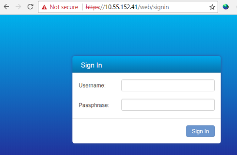
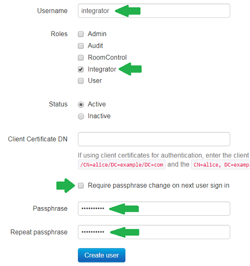

# Step 2: Getting started with your collaboration device

To start with, let's see how to interact with the collaboration device from its built-in management web interface.

As Cisco collaboration devices can be registered either to the Cisco Webex cloud platform, or to CUCM/VCS on-premise, the way to access the local web interface will vary. 

On this page, we’ll give details for on-premise registered devices.

**-->Jump to the NEXT PAGE for cloud-registered devices**

1. Make sure that your laptop has local (or VPN) connectivity to the collaboration device, and that you know it's IP address

2. Browse to the device's admin page:  `https://{device_IP}/web/signin`

    

    >Note: you may need to accept the device's self-signed HTTPS certificate (the exact process varies by browser/OS)

3. Enter the admin credentials for your device. You now have access to check status and configure the device:

    

As an admin user, you can access all of the device's features through this user-friendly interface.

For the purposes of this lab, we’ll stick to the **Status**, **Configuration** and **Call** tabs, as users with the 'integrator' role are generally limited to those capabilities (more on this later.)

## Creating an 'integrator' user (on-premise)

We’ll now create a new user on the device for use in this lab.  This user will be given the 'Integrator' security role, which limits API access to features and functions likely to be used by applications and third-party control systems:

1. Click the **Security** menu, select **Users**, then **+ Add new user** and fill in the form as specified below:

  - Enter Username: `integrator`
  - Select (only) the **Integrator** role
  - Enter Passphrase: `integrator`
  - Disable **Require passphrase change on next user sign in**

    

2. Click 'Create user', and go straight to [Step 4](https://learninglabs.cisco.com/lab/collab-xapi-intro/step/4) (skip the next page)
