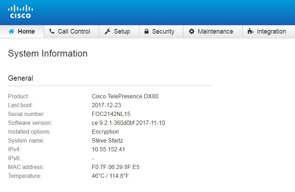

# Step 2: Getting Started with your Collaboration Device

To start with, we’ll show you how to interact with your Collaboration Device from its built-in Web Interface.

As Cisco Collaboration devices can be registered either to Cisco Spark or on-premises to a CUCM service, the way to access the local web interface will vary. In this step, we’ll give details for on-premises device. 

**Jump to the next section if you want to access a Spark-registered device.**

Make sure your laptop has local connectivity to your collaboration device Connect and type its ip-adress in a Web Browser.
You’ll be redirected to a login banner.
In the example below, we typed '10.55.152.41' and got redirected to https://10.55.152.41/web/signin

Enter your devices admin credentials and get access to the Web Interface from which you can check state and configure your device.

As an admin user, you get access to all CE features through a friendly interface.
For the purpose of this lab, we’ve opted to stick the 'Status', 'Configuration' and 'Call' features exposed to the Integrator role.

## Integrator Role

We’ll now create a new and distinct user powered with the Integrator role authorization.

Click the 'Security' menu, select 'Users' and fill in the form as specified below:
- pick 'integrator' as user name
- select the sole Integrator role 
- enter ‘integrator’ as Passphrase

Click 'Create User', and go to step 4.
