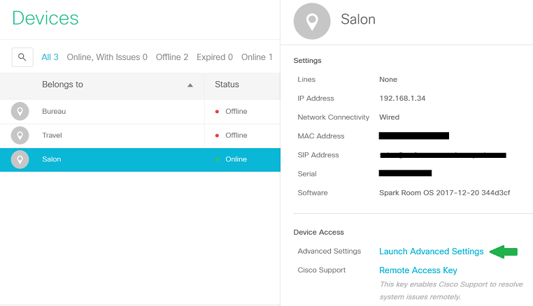
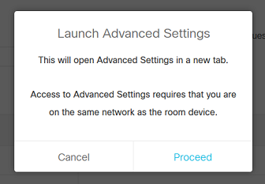
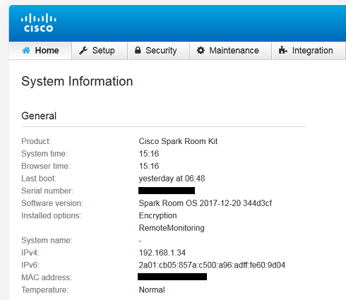
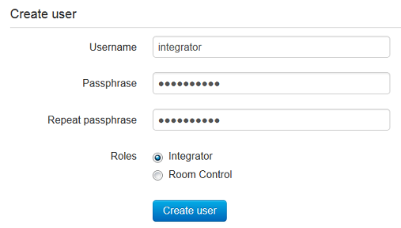

# Step 3: Accessing the Admin Interface for Webex-Registered Devices

**-->If your device is registered to CUCM/VCS on-premise and you've created the 'integrator' user, you can [skip to the next step](https://developer.cisco.com/learning/lab/collab-xapi-intro/step/4)**

Follow the instructions below if your device is registered to the Cisco Webex cloud platform:

1. Login to the [Webex Control Hub](https://admin.webex.com) as an admin for the Organization that manages your device
  > Note: Make sure to use a modern browser such as Chrome or Firefox. Internet Explorer is not compatible with the following instructions

2. Navigate to the **Devices** page in Control Hub, and select your device from the list

3. Scroll down through the 'Device Details' on the right, and click  **Launch Advanced Settings**
  >Note: Access to advanced settings through the Control Hub may be disabled for some organizations. If you don't see the 'Launch Advanced Settings' link among your device's properties, please contact your Webex support contact for assistance  

  

 

4. A confirmation dialog will open, click **Proceed**

 

5. A new browser window will open at `https://{device_ip}/cloud-login`, displaying the _Administration Web Interface_ for your device
  >Note: If you are not connected to the same network as your device, or it's IP address is otherwise unreachable, the web page will time out after a few seconds, and the Control Hub dialog will show 'Advanced Settings Unavailable - Connecting to the device was unsuccessful'  

  

  

## Creating an 'Integrator' user (cloud)

Let’s now create a new user with the 'integrator' role, which limits xAPI access to features and functions likely to be used by applications and third-party control systems deployed by system integrators/partners.  (To find out more about local user roles for cloud-registered devices, check the [Local User Administration](https://collaborationhelp.cisco.com/article/en-us/DOC-17938) article on CollabHelp.)

To access your device's local web admin UI, you will need to launch it from the Webex Control Hub management site:

1. From the customer view in https:/​/​admin.webex.com, go to the **Devices** page, and select your device from the list

1. Scroll down the devices pane, and click Launch **Advanced Settings**

>Note: your PC must be on the same network as your collaboration device in for this lab

Once you have the device's local web admin page open:

1. Click the **Security** menu, select **Users**, then **+ Create new user** and fill in the form as specified below:

  - Enter Username: `integrator`
  - Enter Passphrase: `integrator`
  - Select (only) the "Integrator" role

    

2. Click **Create user**, and proceed to the next step
