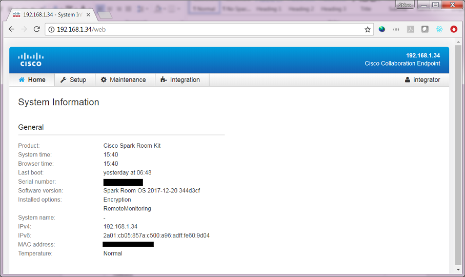
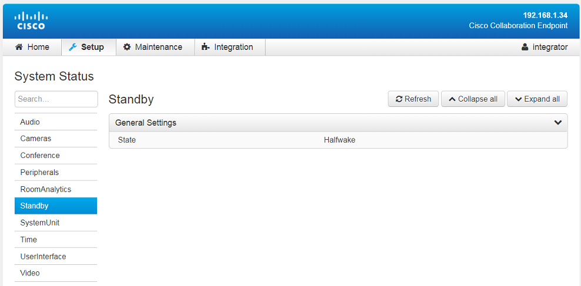
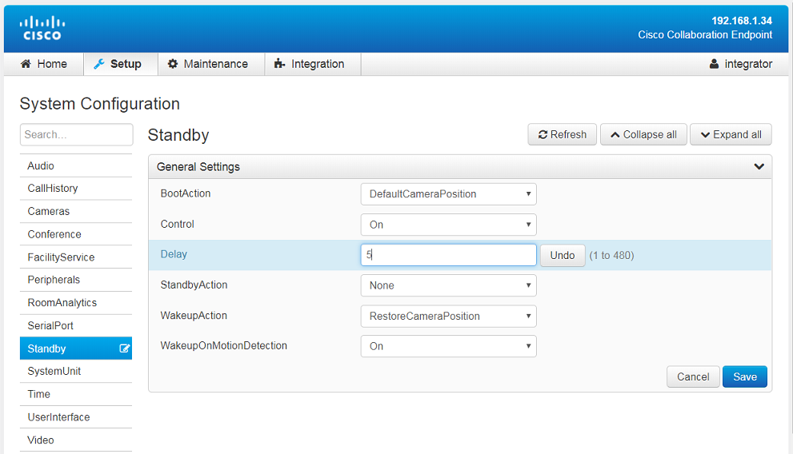

# Step 4: Tour of your Device’s Web Interface

In the last steps, you signed in as a user with Integrator role to your device’s Web Interface. 
We’ll now take a quick tour of the interface.

In the last steps, we created a distinct Integrator user. We’ll now connect with this account and take a tour of the interface.

From a web brower, open the ip-adress of your room device, and authenticate with the newly created Integrator credentials. 
You will be redirected to your device’s Web Interface as show below:

The available menu entries are:
- Home: your device’s informations
- Setup
   - Configuration: read or change configuration parameters 
   - Status: current state of your device
   - Personalization: modify text and branding images
- Maintenance
   - Restart
- Integration
   - In-Room Control: let’s you add extra custom User Interface components

Click `Setup > Status > Standby` to check your device’s current Standby state.

Now click `Setup > Configuration > Standby`

Make sure the ‘Control’ setting is set to On, so that your system does go on Standby when the delay as elapsed.

Changed the Delay setting to '5', so that after 5 minutes of inactivity, your system will automatically go to 'Standby' mode.
Click 'save'

Note that you can also change the WakeUpOnMotion setting to have your system wake up as someone enters the room.
We’ll now use T-shell to change our system’s Standby state through commands.
