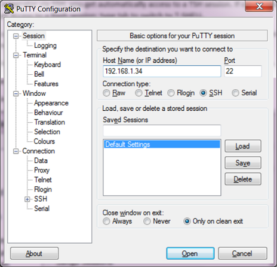

# Step 5: Interacting with xAPI using SSH

A collaboration devices' xAPI is accessible from a simple SSH connection, which lets you interact with xAPI from a 'command line' (this is how many third-party control systems interact with xAPI, e.g. Crestron/AMX). From there you can request status information, update the device configuration, listen for events and send commands to your device.

**Let’s experiment!**

> Note that if you cannot open a SSH connection to your device, there is a chance SSH access has been disabled. To enable SSH, connect to your device's web interface as an admin, open **Setup** > **Configuration** and check the **NetworkServices** tab, where SSH settings will be listed

1. Log in to the device via SSH:

      **For Mac and Linux users**: from a terminal, open a SSH connection to your device by entering:

      ```shell
      ssh <device_ip> -l integrator
      ```

      **For Windows users**: launch **PuTTY** (see this lab's BYOD/pre-requisites), start a new session with your device's ip address, and click **Open**. Enter your integrator user credentials:

      

    > Note: if you're having trouble logging in, make sure **Require passphrase change on next user sign in** is disabled for the integrator user in the web admin under **Security** > **Users**

2. Use the `xstatus` command to retrieve the device's standby state.  In the SSH session, enter:

    ```shell
    xstatus /Standby
    ```
    and check that the displayed info corresponds to the same information in the web interface:

    ```shell
    *s Standby State: Standby
    ** end
    ```
   > Note that the `*s` prefix in the response stands for 'Status information'. The SSH interface supports helpful command completion at any point by pressing `Tab`

3. Next let's view the various attributes of the device's standby configuration, enter:

    ```shell
    xconfiguration Standby
    ```
    which should return something like:
  
    ```shell
    *c xConfiguration Standby BootAction: DefaultCameraPosition
    *c xConfiguration Standby Control: On
    *c xConfiguration Standby Delay: 10
    *c xConfiguration Standby StandbyAction: PrivacyPosition
    *c xConfiguration Standby WakeupAction: RestoreCameraPosition
    *c xConfiguration Standby WakeupOnMotionDetection: On
    ** end
    ```

**Let’s now experiment with using 'xcommands' to change the state of the device**

1. Make sure your device is in standby state.  You can do this manually via the web admin, under **Setup** > **Personalization** by clicking **Put the system in standby state**

2. From SSH, use a `xcommand` request to disable standby mode:

    ```shell
    xcommand Standby Deactivate
    ```
    
    which will return with:

    ```shell
    *r StandbyDeactivateResult (status=OK):
    ** end
    ```

3. Visually confirm that your device has left standby mode

    >Note: you can remotely view what's on the screen of the device or its Touch10 controller via the web interface, under **Maintenance** > **User Interface Screenshots**.  If your device does not have a main screen attached (e.g. Sandbox), view the Touch10 interface  

4. Next, let's use `xstatus` to confirm the standby status:

    ```shell
    xstatus Standby
    ```

    which should return something like:

    ```shell
    *s Standby State: Halfwake
    ** end
    ```

**Finally, let’s experiment with xAPI notifications**

xAPI provides the ability to register for feedback notifications generated by the device.  Feedback can be anything from a change in standby status, to an outgoing call being placed, to a change in the number of faces detected by the camera.  

A device in operation may produce a very high number of different notifications in production operation, including many your application may not care about.  xAPI provides the ability to indicate very specific or very general feedback filters, so that you receive only the notifications you are interested in.

Let's see how this works:

1. First, let's put the device in standby mode (if it's not already.)  Enter:

    ```shell
    xcommand Standby Activate
    ```

2. Next, let's register to receive feedback notifications when the standby status changes:

    ```shell
    xfeedback register /Status/Standby
    ```

2. Finally, turn standby mode off with an `xcommand`:

    ```shell
    xcommand Standby Deactivate
    ```

    >Note: DX models do not support the `xcommand Standby Activate/Deactivate` command.  You may need to let the device sit idle until the standby timer expires on its own (consider configuring a short timer value), then wake the device up manually

  2. Check to see that the following feedback message is automatically sent to your SSH session:

      ```shell
      *s Standby State: Off
      ** end
      ```

If you wait another 5 minutes (or whatever delay you configured in the previous step), you would likely see new notifications flying by as shown below:

```shell
*s Standby State: EnteringStandby
** end
*s Standby State: Standby
** end
```

Moreover, if the `WakeupOnMotionDetection` feature is enabled and you leave/re-enter the room, you might see this extra event:

```shell
*s Standby State: Halfwake
** end
```

## Going further

The CE device 'T-Shell' xAPI command line environment provides auto-completion functionality, which can be a good way to easily check command syntax or even explore all the possible commands and options available.

For example, you can execute a base command - like `xstatus` - by itself, which results in a print-out listing of all the available options and sub-options under that command.

At your own pace, try the following commands, just on their own, to see what happens:
-	`xstatus`
-	`xconfiguration`

What could you do with the information provided?  Feel fry to try out some of the options for each!

The scope of events you receive can be narrowed or widened depending on the 'path' you provide to the `xfeedback register` command.

Try entering `xfeedback register /Status` to listen to all status changes, or simply `xfeedback register /` to listen to every type of event, systemwide. Then perform various interactions with your device such as turning up or down the volume, or initiating a call. As the xfeedback events can get pretty numerous/verbose, make sure to type `xfeedback deregisterall` to turn off all event registrations when you're finished.

### USB device events

If your system is running CE 9.6+, you can plug a USB keyboard into the device's base (Room and DX series) and receive events corresponding to key press/release activity:

1. Enable USB device event detection by logging into your device via SSH and running the following command:

    ```shell
    xConfiguration Peripherals InputDevice Mode: On
    ```

2. Type a few keys on the connected keyboard and you should see 'Key' (key identifier), 'Code' (numerical key code), and 'Type' (pressed or released) events appearing in the terminal:

    ```shell
    *e UserInterface InputDevice Key Action Key: KEY_O
    *e UserInterface InputDevice Key Action Code: 24
    *e UserInterface InputDevice Key Action Type: Pressed
    ** end
    *e UserInterface InputDevice Key Action Key: KEY_O
    *e UserInterface InputDevice Key ActionCode: 24
    *e UserInterface InputDevice Key Action Type: Released    
    ** end
    ```
**Congrats, you've just learned about Cisco collaboration device programmability!**

In essence, the xAPI is a bi-directional interface that lets you check your device state, modify configuration settings, register for real-time events, and take actions by sending commands.

These actions can be taken from the physical device controls (or Touch10), its web interface, or SSH.  

Next, we'll talk about an additional avenue for accessing xAPI we haven't yet covered: via HTTP...
