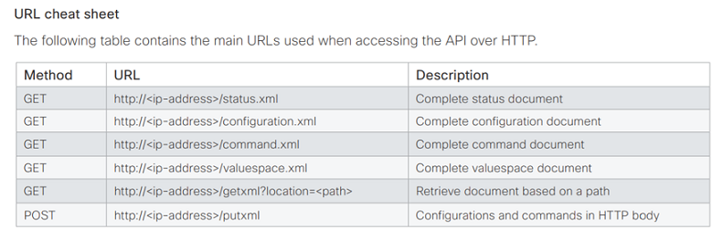
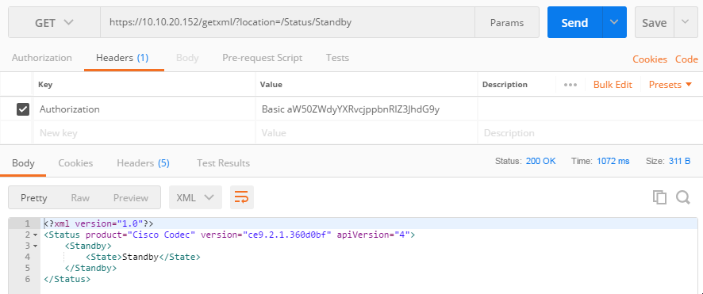

# Step 6: Invoking xAPI via HTTP

In this step, you’ll learn to interact with xAPI via HTTP.

The xAPI HTTP protocol details are documented in your device’s API Reference Guide, as shown on page 33 of [RoomKit's Reference Guide](https://www.cisco.com/c/dam/en/us/td/docs/telepresence/endpoint/ce92/room-kit-api-reference-guide-ce92.pdf), for example.

<div align="left"></div><br/>

Basically:
- Your device exposes an HTTP/HTTPS server for REST API requests
- Data are exchanged as `text/xml` payloads, and _Basic Auth_ is used for authentication
- The `/getxml?location=` URI path is used to retrieve status information
- The `/putxml` URI path lets you POST configuration and command requests

**Let’s retrieve the current value of the device's standby status via HTTP**

In the steps below, you will need to specify user credentials in the `Authorization` header.  xAPI requires these credentials be in the [Basic Authentication](https://en.wikipedia.org/wiki/Basic_access_authentication) standard format.  For this lab, we have pre-generated the `Authorization` header value for you, based on the 'integrator:integrator' username and password:

```
`Basic aW50ZWdyYXRvcjppbnRlZ3JhdG9y`
```

If you are using a different username/password combination, you can use an online service such as [Base64Encode](https://www.base64encode.org/) to encode the 'username:password' combo (note the required `:`).

Or, on a Mac/Linux system, you can also generate this password with the following terminal command:_

```shell
echo -n "myuser:mypassword" | base64
```

**For cURL users**

[cURL](https://curl.haxx.se/) is a flexible command line tool for making HTTP requests.  If you have cURL available on your PC, open a terminal and enter the command below (replacing with your device’s IP address and credentials, if different):

```shell
curl --insecure -X GET "https://{device_ip}/getxml?location=/Status/Standby" -u myuser:mypassword
```

this should return something like:

```shell
<?xml version="1.0"?>
<Status product="Cisco Codec" version="ce9.3.0.344d3cf" apiVersion="4">
  <Standby>
    <State>Standby</State>
  </Standby>
</Status>
```

Notice how the information returned is similar (though in a different format: XML) than what you saw via SSH.

**For Postman users**

[Postman](https://www.getpostman.org) is a nice GUI for testing and playing with HTTP and REST APIs.

In Postman, create and send a new `GET` request pointed at your device’s `https://{device_ip}/getxml` endpoint, with an **Authorization** header value: `Basic aW50ZWdyYXRvcjppbnRlZ3JhdG9y`

<div align="left"></div><br/>

>Note: if Postman has trouble connecting to the device, you might try disabling 'SSL certificate verification' (temporarily!) or importing your device's certificate in the settings (see  https://www.getpostman.com/docs/v6/postman/launching_postman/settings)

You should receive an XML response body similar to what you got from cURL, above.

## What We've Learned So Far

Let's sum it up:

* How to configure an integrator user for application use

* Basic understanding of how xAPI requests work, based on a simple 'Standby/Halfwake' use case

* Using various mechanisms/tools to read status information, make configuration changes, send commands, and listen for events

For the last part of this lab, we’ll dig into a slightly more advanced capability of your collaboration device: i.e. using xAPI to initiate a live video call!
