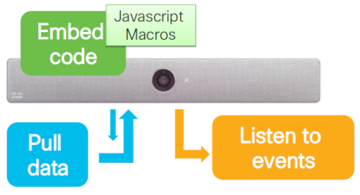

# Exploring on-board xAPI Macros for Cisco collaboration devices

## Objectives

Learn about the JavaScript 'macro' capabilities for running custom code onboard Cisco CE collaboration devices.

In this lab you will learn about the use-cases, capabilities and limitations of macros, including hands-on deploying and coding a few simple sample macro applications:

* Deploy and run a simple macro app
* Experiment with a macro application interacting with CE device custom in-room controls
* Make external HTTP API requests from macro code

## Prerequisites

* A Cisco collaboration device with the following requirements:

  - Cisco DX, SX (except SX10), MX, Room Kit, or Webex Board
  - Running the _Cisco Collaboration Endpoint CE v9.6+_ version of software

  Alternatively, you can use one of the [Room Kit Sandboxes](https://github.com/CiscoDevNet/awesome-xapi#sandboxes) offered to DevNet community members free of charge.

* Admin credentials to your device, if it's on-premise. If cloud-registered, you need admin access to the [Webex Control Hub](https://admin.webex.com/login) of the organization to which your device belongs

* A PC with local network or VPN IP connectivity to your device, and the following software tools, recommended:

    - An HTML5 web browser (except Internet Explorer)
    - SSH: Mac/Linux (built-in); Windows - [PuTTY](https://www.putty.org/)
    - Postman REST client: [Postman](https://www.getpostman.com)

**We recommend that you complete the following labs prior to attempting this one:**

* [Introduction to xAPI for Cisco collaboration devices](https://developer.cisco.com/learning/lab/collab-xapi-intro/step/1)
* [Customizing collaboration devices from code](https://developer.cisco.com/learning/lab/collab-xapi-branding/step/1)
* [Creating custom in-room controls for Cisco collaboration devices](https://developer.cisco.com/learning/lab/collab-xapi-controls/step/1)

## Step 1: About CE customization with xAPI

If you’re new to CE device customization and xAPI, here are a few starting points:

- Your Cisco collaboration device includes an API - known as **xAPI** - that allows bi-directional communication with third-party applications and control systems, such as those from AMX or Crestron
- There are multiple ways to access xAPI: Telnet/SSH, HTTP, RS-232 serial connection, and via JavaScript using the jsxapi package. Regardless of the method you choose, xAPI has the same general format and behaves similarly
- In this lab, we’ll focus on running jsxapi based applications using macros

>Note: the exact set of customization and xAPI features and supported devices vary depending on the model and version of CE. Please check the [Cisco TelePresence CE software Release Notes](https://www.cisco.com/c/dam/en/us/td/docs/telepresence/endpoint/software/ce9/release-notes/ce-software-release-notes-ce9.pdf) for the complete list of supported devices.

### Macro overview

In November 2017, CE 9.2.1 introduced a powerful **macro** engine for on-premise devices. Macros provide a JavaScript run-time environment on board the collaboration device itself, where code that can automate or change parts of the video endpoint behavior can run - avoiding the need to deploy a separate application server or have users interact with a separate control system or UI beyond the collaboration devices standard (extensible) interface (Touch10 or DX on-screen.)

CE 9.6 extended macro functionality to cloud-registered devices, as well as adding HttpClient capabilities for interacting with external REST-like APIs.

### Node.js xAPI library for JavaScript: jsxapi

In January 2018, the 'jsxapi' Node.js package was [released on npm](https://www.npmjs.com/package/jsxapi), and via an [opensource project on GitHub](https://github.com/cisco-ce/jsxapi). This library wraps xAPI functionality in an easy-to-use Node.js package for server-side JavaScript developers.

The on-board JavaScript runtime environment for macros provides and exposes this jsxapi package for use by scripts, with functionality identical to the NPM package.  Apps written for server-side Node.js using jsxapi should be easily portable to the macro environment with minimal changes (notwithstanding the caveats below...)

### Macro environment limitations

While collabation devices have powerful onboard CPU processing capabilities, it is important that these devices protect resources needed to run the high-quality video and collaboration functions they were designed for.  As a result, the macro runtime environment for onboard JavaScript apps has some important limitations for security and performance assurance:

* No access to local storage or file systems
* No ability to install external packages into the JavaScript environment (e.g. via NPM)
* Certain limitations on the number of macros configurable, memory available, and CPU usage
* No access to native JavaScript networking capabilities, with the exception of:
* HttpClient functionality, which is limited to POST/PUT and response status code only (more on this in a bit)

>Interesting fact: the macro runtime environment is based on the [Duktape](https://duktape.org/) embeddable JavaScript engine

### xAPI documentation

For more details about installation, configuration and extensibility via xAPI, refer to these guides:

- [Docs for DX70 and DX80](http://www.cisco.com/go/dx-docs)
- [Docs for MX Series](http://www.cisco.com/go/mx-docs)
- [Docs for SX Series](http://www.cisco.com/go/sx-docs)
- [Docs for Room Series (RoomKit and Codec Plus)](http://www.cisco.com/go/roomkit-docs)
- [Docs for Webex Boards](https://www.cisco.com/c/en/us/support/collaboration-endpoints/spark-board/tsd-products-support-series-home.html)
- [Getting Started Guide](https://www.cisco.com/c/dam/en/us/td/docs/telepresence/endpoint/ce95/dx70-dx80-sx10-sx20-sx80-mx200g2-mx300g2-mx700-mx800-room-kit-getting-started-guide-ce95.pdf) for DX, MX, SX, and Room Series

Note that these guides primarily apply to on-premise registered devices - cloud registered devices may support a more limited set of features depending on model CE version. We’ll cover some of these differences in the next sections. For now, note that you’ll find additional documentation for cloud-registered devices at [Collaboration Help](https://collaborationhelp.cisco.com/article/en-us/jkhs20).

To keep up to date with CE and xAPI developments, you may want to check the [Cisco Collaboration Endpoint software - CE9 release notes](https://www.cisco.com/c/dam/en/us/td/docs/telepresence/endpoint/software/ce9/release-notes/ce-software-release-notes-ce9.pdf) on a regular basis.
