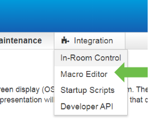
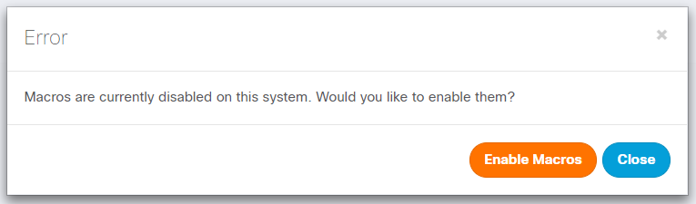
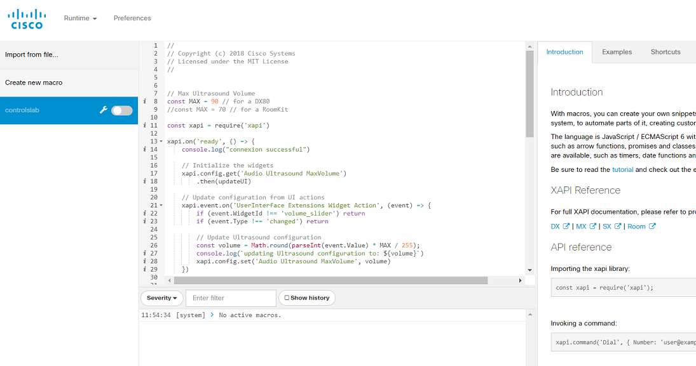
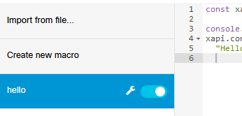
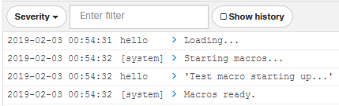
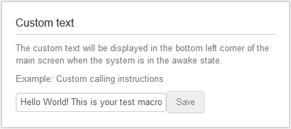

# Step 2: Macro 'Hello World'

Let's take a quick tour of the **Macro Editor** that is part of the collaboration device web admin UI, and then test running a no-frills sample macro.  The **Macro Editor** combines the ability to manage/upload/export macros, create/edit/run macros as well as providing documentation and tutorials for getting started with macro development:

1. Sign in to your device's web interface (as a user with 'administrator' role) and navigate to the **Integration** > **Macro Editor** menu (it may be helpful to open the editor in a new browser window)

    

2. The first time the Macro Editor is launched, you are asked to authorize the use of macros

    Click **Yes, enable Macros**

    

3. As the macros dashboard opens, look for the left panel that helps manage the macros deployed on your device:

    

    Click **Create a new macro**

4. Copy and paste in the JavaScript code below:

    ```javascript
    const xapi = require('xapi');

    console.log('Test macro starting up...');
    xapi.config.set('UserInterface CustomMessage', 
        "Hello World! This is your test macro");
    ```

6. Save your macro and rename it `hello`

7. Launch your macro by clicking the round toggle shown below:

    

    You should see some output in the Macro Editor console window, including the message in the `console.log('Test macro starting up...')` command:

    

1. You can confirm that the `xapi.config.set()` command to set the on-screen custom display message worked by switching to the admin web UI and browsing to **Setup** > **Personalization**:

    

>To learn more about xAPI coding with jsxapi, check out the lab [Introduction to xAPI for Cisco collaboration devices](https://learninglabs.cisco.com/lab/collab-xapi-intro/step/1)

**Congrats! Your macro is up and running!**

## Going Further

Take some time to explore the various resources provided in the Macro Editor on the right.

You’ll find several tabs with useful links:

- **Introduction**: this tab contains handy code snippets demonstrating how to invoke commands, listen to events and update configuration settings
- **Examples**: these scripts are organized by use-case, are fully operational, and can be experimented by clicking the **Load Example** button
- **Tutorial**: this guide is an excellent walk-through to help you in your first steps with the macro framework (the guide is also available online here [CE 9.2.1+ Macros Tutorial](https://github.com/ObjectIsAdvantag/xapi-samples/blob/master/macros/pdf/macro-tutorial.pdf).

