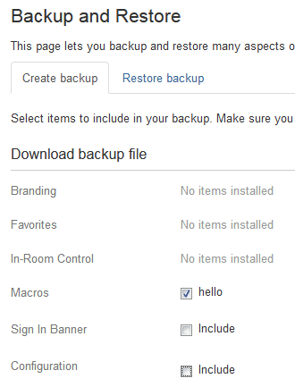
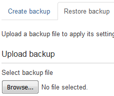
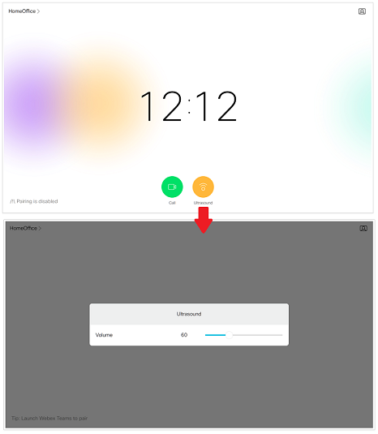
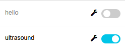
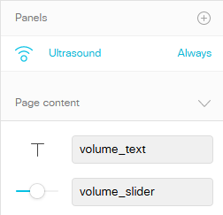

# Step 2: Managing macros

We'll dive deeper into some of the powerful features and functions of macro coding in a bit, but first lets consider the question of how to deploy macros in the enterprise.  (This will also help us provision a complete interactive macro/in-room-control sample for the next section...)

As we've briefly seen in the previous step, it is pretty straightforward for an admin to login to the device web UI, create a macro, enter some JavaScript code and launch the app.  However, in the happy situation where you have a large number of room devices to which you'd like to deploy a particular macro (or a whole set of macros), manually creation just doesn't scale...

## CE device configuration backup/restore

Most of the macro deployment mechanisms we'll examine here will be based on the concept of encapsulating device configuration as XML, storing that XML in a file, and then installing that configuation file to other collaboration devices.  I.e.: via backup and restore.

As of CE 9.3, it is possible via the device admin web UI to create 'backup' files containing selected components of the local device configuration.  The admin can pick and choose which types of configuration to save, including:

* Favorites (Local phonebook)
* Sign-In Banner
* Branding images (Halfwake Background, Halfwake Branding, Branding)
* Macros (Select all or individual macros)
* In-room control designs
* Configuration settings (select configurations to backup)

**Let's give it a try:**

1. In the device admin web UI, browse to **Maintenance** > **Backup and Restore**

1. In the **Download backup file** section, uncheck all the options _exccept_ 'Macros':

    

1. Click on **Download backup** and save the offered .zip file.

    It should have a name something like `backup-SEPB0268040C6F8-20190203-0844.zip`

1. Locate this download .zip file and open/extract it.

    You should see two files `manifest.json` and `macro-hello.js`

1. Go ahead and open `macro-hello.js` and verify that it contains the exact contents of the JavaScript macro we created in the previous step.  

    You can peek into `manifest.json` too, which is interesting...you should see something like:

    ```json
    {
        "version": "1",
        "profile": {
        "macro": {
            "items": [
            {
                "payload": "macro-hello.js",
                "type": "zip",
                "id": "hello"
            }
            ]
        }
        },
        "profileName": "backup-SEPB0268040C6F8-20190203-0844",
        "generatedAt": "20190203-0844"
    }
    ```

If this was a macro (or a bundled macro/in-room-control/configuration set) you wanted to deploy to another collaboration device, you could simply log into that device's admin web UI and select the **Restore backup** tab from this screen and instantly deploy it.  No copy/pasting!



## Restoring a pre-made configuration with macro and in-room controls

The sample solution we will now deploy to your room device installs a new macro plus an in-room control set.  This custom control panel will allow the user to control the device's ultrasound pairing volume on the Touch10/screen dynamically, vs. asking an admin to log into the web UI to make the configuration change.



The use-case might be environments where multiple collaboration devices are close together, or even in the same room (such as a demo or training lab!)  It may be desireable to provide an easy way for end-users to disable or attenuate the ultrasound features of individual devices to avoid clients continuously trying to pair with multiple devices.

>For a detailed exploration of this sample app and in-room controls, see the learning lab [Creating custom in-room controls and xAPI apps](https://learninglabs.cisco.com/lab/collab-xapi-controls/step/1)

**Let's perform the config restore:**

1. In your browser, click the following link to download the prepared configuration file: [ultrasound_demo.zip](assets/ultrasound_demo.zip)

1. In the device admin web UI, browse to **Maintenance** > **Backup and Restore**

1. Select the **Restore backup** tab, **Browse** for the `ultrasound_demo.zip` file you downloaded above, then click **Upload file**

1. Once complete, you can go back to the **Macro Editor**, refresh the page if needed, and verify that there is a new macro installed a running named "ultrasound":

    

1. Now, open the **In-Room Control Editor**, refresh the page if needed, and confirm that there is a new "Ultrasound" panel.

    Click on the **Preview** button and move the slider around.  Note that the numeric volume display in the middle of the panel updates automatically (due to the macro code, which is also dynamically modifying the device's ultrasound volume configuration in sync)

    

## Automatic provisioning of macros / controls with CUCM/TMS

While restoring a 'template' backup file to multiple devices is much easier than manually creating macros and in-room controls sets step-by-step on each one individually, it still requires a significant effort and is susceptible to user error.  Luckily collaboration devices running CE 9.3+ registered to CUCM or TMS can be configured to automatically retrieve, verify, and install template backup files from a web server (or CUCM TFTP) on startup.

Complete details on how this mechanism works, its capabilities and needed configurations are available in the Administration uide for your device (see the **Maintenance** > **Backup and restore configurations and custom elements** section.)

## Programmatic provisioning of macros / controls

Macros and other elements - like in-room control sets - can also be provisioned remotely using (you guess it!) xAPI itself.

For example, you could run the following JavaScript application from a remote machine (like your PC), which installs and activates the "inception" macro embedded within its code:

```javascript
const jsxapi = require('jsxapi')

const xapi = jsxapi.connect("ssh://{device_ip}", {
    username: 'admin',
    password: 'password'
});

xapi.on('ready', () => {
    xapi.command('Macros Macro Save',
        { Name: "inception" },
        `
        const xapi = require('xapi');
        console.log('Welcome to inception...');
        `
    ).then( () => {
        xapi.command('Macros Macro Activate', { Name: "inception"} );
    })
});
```

The remote jsxapi app or _even the macro installed by the remote app_ could then install a custom in-room control set (see the `panel_1.xml` file found in the backup .zip we uploaded earlier), like this:

```javascript
xapi.command('UserInterface Extensions Set',
    { ConfigId: 'default' },
    `
<Extensions><Version>1.5</Version><Panel>
    <PanelId>panel_1</PanelId>
    <Type>Statusbar</Type>
    <Icon>Proximity</Icon>
    <Order>1</Order>
    <Color>#FFB400</Color>
    <Name>Ultrasound</Name>
    <Page>
      <Name>Ultrasound</Name>
      <Row>
        <Name>Volume</Name>
        <Widget>
          <WidgetId>volume_text</WidgetId>
          <Name>?</Name>
          <Type>Text</Type>
          <Options>size=1;fontSize=normal;align=center</Options>
        </Widget>
        <Widget>
          <WidgetId>volume_slider</WidgetId>
          <Type>Slider</Type>
          <Options>size=3</Options>
        </Widget>
      </Row>
      <Options/>
    </Page>
  </Panel>
</Extensions>    
    `
); 
```

**Next, let's imagine extending macros to talk to outside APIs and services via HTTP...**