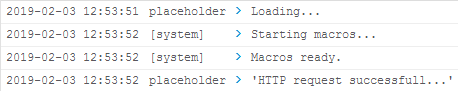

# Step 3: Making external HTTP requests

While the automation possibilities of a powerful onboard macro engine and jsxapi are extensive, you might imagine use-cases which would require an application to access resources elsewhere on the network - i.e. by making HTTP REST requests to an API in your data center, or even in the cloud.

One of the significant limitations of the macro runtime environment is that native JavaScript networking facilities are restricted - scripts are not permitted to open network sockets, or use common communication libraries like `request` or `fetch`.

However, as of CE 9.6, a jsxapi command for making HTTP requests from macros is now available: `HttpClient`:

```javascript
xapi.command('HttpClient Post',
    { Header: ["Content-Type: application/json", "Authorization: Bearer " + token],
      Url: "https://api.ciscospark.com/v1/messages"
    },
    JSON.stringify(payload))
```

This command can be used to send a data payload, in any format you can assemble, to a remote URL, using customizable headers, and return the HTTP status code result.  There are some limitations, however:

* Only HTTP POST and PUT verbs are supported (this proscribes GET)
* The HTTP response body is not available to the macro code - only the HTTP status code is returned (e.g. `200 OK` or `401 Unauthorized`)

This means that API requests will tend to be limited to doing things like turning peripheral systems on/off and manipulating simple 'control' APIs.  Operations like retrieving and processing data (say, from a messaging API or document store) will be difficult to implement in macros, and will likely need a separate server-based component.

## HttpClient configuration

By default HttpClient functionality is disabled on collaboration devices...

**Let's go ahead and turn HttpClient mode on:**

1. Open a terminal window, and SSH into your device (admin user credentials needed:)

    ```shell
    ssh {device_ip} -l {admin_user}
    ```

1. Once logged in, run this command to enable HttpClient:

    ```shell
    xConfiguration HttpClient Mode: On
    ```

## HttpClient security settings and considerations    

Also by default, HttpClient will always attempt to authenticate the TLS security certificate presented by the remote HTTPS server for any HTTPS connection attempt.  However, as the macro environment does not have any certificate authorities configured by default, this will fail unless the admin specifically provisions the target server's certificate on the device.

>Note, this provisioning is pretty straightforward - see your device's Administrator Guide under **Configuration** > **Manage the list of trusted certificate authorities (CAs)**

One option for development/testing is to enable a configuration which allows 'insecure' HTTPS requests by HttpClient (just don't enable or use this in production!)

**Let's enable 'AllowInsecureHTTPS' mode:**

1. From your terminal/SSH session, run this command:

    ```shell
    xConfiguration HttpClient AllowInsecureHTTPS: True
    ```

    >Note, in addition to enabling AllowInsecureHTTPS mode, it is necessary to pass a special option to the HttpClient command to execute any particular request as insecure...more on this in a bit.

>Note: HttpClient mode/security settings can also be modified via the device's admin web UI    

## A simple HttpClient macro sample

To test your device's HttpClient functionality, we will make an HTTP request via macro to a well known 'dummy' REST API hosted by [JSONPlaceholder](https://jsonplaceholder.typicode.com/).  This API service nominally models a very simple message/todo service, albeit populated with dummy data.  It will 'echo' any data sent to it via POST or PUT, sending back the same payload it received.

**Let's try it:**

1. From the device admin web UI, open the **Macro Editor**

1. Create a new macro, and name it: `placeholder`

1. Delete any code in the macro and replace with the JavaScript below:

    ```javascript
    const xapi = require('xapi');

    let payload = {
        "userId": 1,
        "id": 1,
        "title": "New message",
        "body": "Lorem ipsum"
    };

    xapi.command('HttpClient Post',
    {
        Header: ['Content-Type: application/json', 'Authorization: Bearer itsme'],
        Url: 'https://jsonplaceholder.typicode.com/posts',
        AllowInsecureHTTPS: 'True'
    },
    JSON.stringify(payload)
    ).then((response) => {
    if (response.StatusCode == 201) {
        console.log('HTTP request successful...');
    }
    }).catch((err) => {
        console.log('HTTP request failed...' + err.data.Message);
    });
    ```

1. Taking a look at the code:

    * Notice that this script does not wait for any user input or other events before performing its main function...it's makes the HttpClient request as soon as it is activated (saving an activated macro will cause it to restart after the save)
    * A `payload` variable is constructed as a JavaScript object with several properties that might be apropos 'new message' request
    * The `xapi.command()` method is used, passing in several parmaters for headers (specifying content type JSON and a 'fake' authorization bearer token), and then using `JSON.stringify()` to transform the `payload` object defined above into a JSON string
    * Notice the special `AllowInsecureHTTPS: 'True'` option is used to allow this request to happen in insecure mode
    * `.then()` is called if the HttpClient request succeeds, and we check for a HTTP `201 Created` status code to indicate the service processed our POST request successfully
    * `.catch()` is called if the HttpClient happens to fail for some reasons, for instance if the URL was unreachable, or the HTTPS certificate check failed

1.  Go ahead and **Save** the macro, and activate it.

    If everything worked, you should see `HTTP Request successful...` in the console log:

    

**This example was pretty abstract, let's try something a little more tangible...**