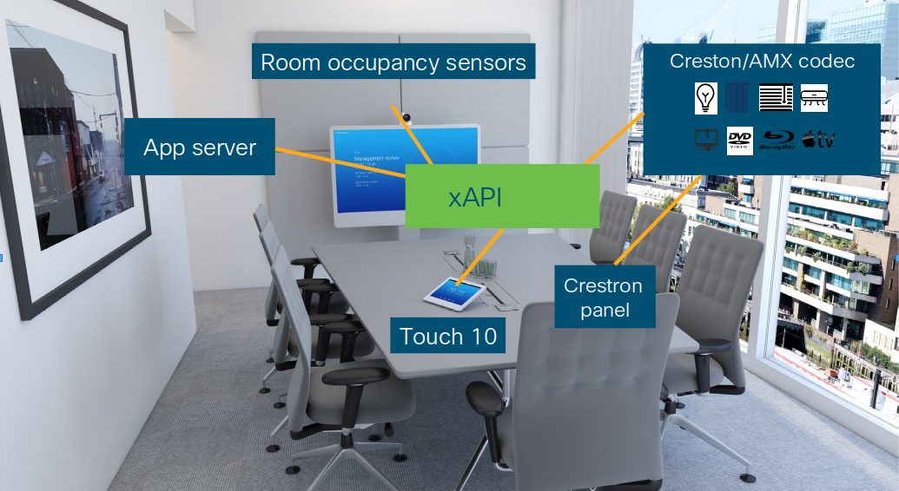
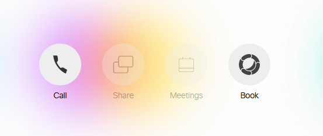
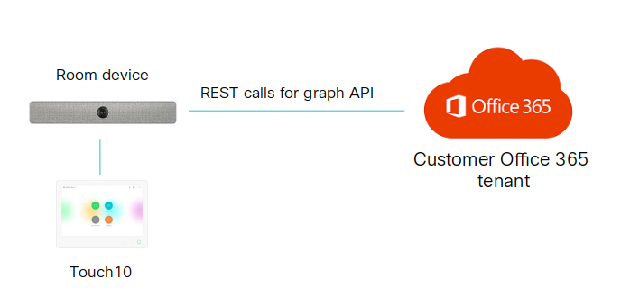
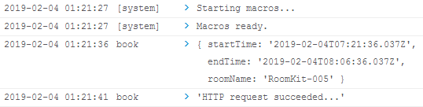
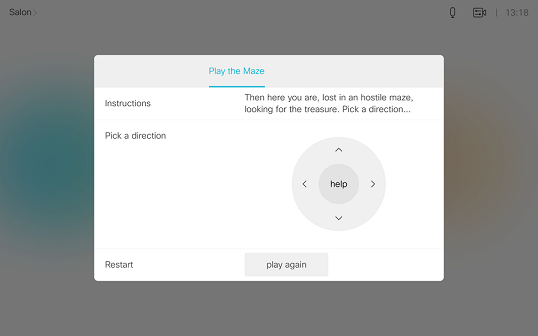

# Step 4: Putting it all together - on-screen booking

For the final sample, we will pull together various collaboration device concepts - xAPI, jsxapi, macros, HttpClient, in-room-controls - to propose a solution to a real-world use-case relevant to enterprises today.

## The problem - making room reservations in-person

For many large enterprises, real estate is the second biggest expense after payroll.


Making the most of special rooms dedicated to highly-effective team meetings (frequently augmented with Webex collaboration) is critical.

Frequently, enterprises have requirements like:

* Users want to grab an apparently unused meeting room on-the-fly, and want to properly reserve the room (e.g. in Outlook365) to avoid conflicts, but it's a pain to open a laptop, login, search for the meeting room and go through the reservation steps.  Users should be able to reserve an empty room and/or schedule a Webex session using the Touch10 interface.

* Users frequently book a meeting room, but never end up using it.  Reservations should be automatically cancelled if no one shows up before 5 minutes after the reservation start time, so that others can utilize the room

* Meetings frequently 'run over' and it's difficult for users to extend both the room reservation and any associated Webex session - again, laptops, logins, lookup and reservation steps are a pain.  Users should be able to request a room / meeting reservation easily from the Touch10 interface.

Solutions to these use-cases exist, but typically involve cobbling together various hardware and software components into a clunky (and expensive) 'Rube Goldberg machine' scenario - e.g. a Cisco room device with a Touch10, _plus_ a Crestron/AMX codec _plus_ tablet interface, _plus_ 3rd party occupancy sensors, _plus_ an external app-server...



The good news is that with Cisco collaboration device automation, xAPI, and macros, all of the above scenarios can potentially be accomplished by creating applications that run on-board the device itself and present customized Touch10 control interfaces for user interaction!

## The solution - a 'Book Meeting Room' panel + macro

The sample macro + in-room-control set we will test next provides a Touch10 panel UI allowing walk-in users to reserve the room for 15/30/45 or 60 minutes, using a simple UI on the Touch10.  

The macro will handle this UI interaction, then make an HttpClient request to a remote app server to 'book' the room, and finally provide feedback on the success/failure of the request via an on-screen alert pop-up.




Note, this sample solution will use the 'fake' cloud REST API we used previously to make a mock reservation.  It is important to understand that, due to the limitations of HttpClient (HTTP POST/Put only, unable to retrieve bulk response data), a production implementation of this solution would need an external HTTP app server which would handle the complex read/write/update/delete API operations with the back-end scheduling service.



## How it works

The sample would operates like this:

* It is deployed by an admin as a template backup file to the room system
* The user clicks **Book** to open the booking panel, selects a duration, and clicks **Submit**
* The macro handles the submit button click, and reads the selected duration value creating a payload object encapsulating details of the booking request (start time, end time, device name, etc.)
* An HttpClient request is made to the JSONPlaceholder cloud REST API service containing the payload data (as this is a mock service, the request will always succeed)
* The HttpClient response return code is checked for success/failure and an appropriate on-screen alert message is displayed

**Let's try it out:**

1. Download the template backup file for the solution from here: [book_demo.zip](/posts/files/collab-xapi-macros/assets/book_demo.zip)

1. From the device admin web UI, 'restore' the backup file to the device

2. Check the **In-Room Controls Editor** to confirm that there is a new "Book" panel present, and check the **Macro Editor** to confirm that a new "book" macro is installed and active

3. From your Touch10 (or via the **Simulator** or **In-Room Control Editor** previewer), open the **Book** panel, select a reservation duration option, and click **Book**

4. If everything works out, you should see a pop-up alert message confirmation your reservation

    You can also check the **Macro Editor** console window to inspect the payload object contents, and success (or failure) console message:

    

**Congrats!  You've completed the lab with flying colors...**

## Code review

Let's look at some of the interesting things going on in this macro (feel free to view the macro's JavaScript code in the **Macro Editor**:)

* Everything happens within a big function called when an event is received from `xapi.event.on('UserInterface Extensions Widget Action', ... )`

* Here we examine the incoming event, and proceed only on the one we need (clicking the Book/submit button:)

    ```javascript
    if ((event.WidgetId == 'button_submit') && (event.Type == 'clicked'))
    ```

* The next section is interesting:

    ```javascript
    Promise.all([ 
        xapi.status.get('UserInterface Extensions Widget 1 Value'),
        xapi.config.get('SystemUnit Name')
        ]).then( ... )
    ```

    'Promises' are a language feature of modern JavaScript which handles asynchronous methods - commands that are called and immediately allow the app to continue, but that sometime later return with their actual results.  `Promise.all()` allows you to bundle and execute multiple promise executions in parallel, to be handled all at once when all complete - here `xapi` requests to read the meeting duration group widget's value and retrieve the system's unit name

* An object is created collecting together the various pieces of the booking request: the start/end times (calculated from the duration value and the current time via `Date.()`), and the system name: `let payload = {...}`

* As in the previous step, the HTTP request is made using the `xapi.command('HttpClient Post',...)`.  Note that we are using the `AllowInsecureHTTPS: 'True'` parameter previously mentioned

* 'Promise chaining' (using `.then()` ) is used throughout the code to link the successful completion of one command with the execution of the next one.  See if you can spot the general structure of the promise chain in this sample:

    ```javascript
    Promise.all(...)
        .then(
            xapi.command('HttpClient Post', ... )
            .then(
                xapi.command('UserInterface Message Alert Display', ... )
            )
            .catch( ... )
        )
    ```

    What do you think the `.catch( err ... )` block does..?

* The final outcome of the function depends on whether the `xapi.command('HttpClient Post')` promise succeeds of fails.  If success, the `.then( ... )` block executes, and an xAPI command is performed to display a popup alert interface (with a 5 second timer); if fail, the `.catch( ... )` block runs, and the `err` object containing failure details is dumped to the console log

## Going further

We've just scratched the surface of the possiblities with macros, and would certainly encourage you to learn and experiment further...

To inspire you, we’ve assembled a collection of custom in-room control definition files, macros and Node.js example scripts in this [xAPI samples repo](https://github.com/ObjectIsAdvantag/xapi-samples).

For fun, you might like trying out the xAPI-based [Maze game](https://github.com/ObjectIsAdvantag/xapi-samples/tree/master/controls/maze_levels)



Check out [awesome-xapi](https://github.com/CiscoDevNet/awesome-xapi) on GitHub for a community curated list of more samples, tools, and resources for CE device development.

And, if you have questions, don't hesitate to chat with us in the [xAPI devs community space](http://bit.ly/join-xapi-devs)
 
