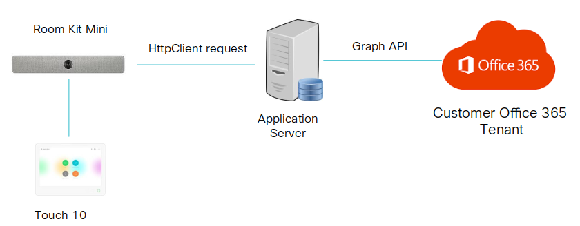
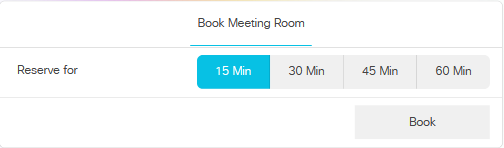

# Putting it all together - making a room/meeting extsion request on-screen

For the final sample, we will pull together various collaboration device concepts - xAPI, jsxapi, macros, HttpClient, in-room-controls - to propose a solution to a real-world use-case relevant to enterprises today.

## The problem - easily managing room reservations in-person

For many large enterprises, real estate is the second biggest expense after payroll.

Making the most of special rooms dedicated to highly-effective team meetings (frequently augmented with Webex collaboration) is critical.

Frequently, enterprises have requirements like:

* Users want to grab an apparently unused meeting room on-the-fly, and want to properly reserve the room (e.g. in Outlook365) to avoid conflicts, but it's a pain to open a laptop, login, search for the meeting room and go through the reservation steps.  Users should be able to reserve an empty room and/or schedule a Webex session using the Touch10 interface.

* Users frequently book a meeting room, but never end up using it.  Reservations should be automatically cancelled if no one shows up before 5 minutes after the reservation start time, so that others can utilize the room

* Meetings frequently 'run over' and it's difficult for users to extend both the room reservation and any associated Webex session - again, laptops, logins, lookup and reservation steps are a pain.  Users should be able to request a room / meeting reservation easily from the Touch10 interface.

Solutions to these use-cases exist, but typically involve cobbling together various hardware and software components into a clunky (and expensive) 'Rube Goldberg machine' scenario - e.g. a Cisco room device withTouch10, _plus_ a Crestron/AMX codec _plus_ tablet interface, _plus_ 3rd party occupancy sensors, _plus_ an external app-server...

The good new is that with Cisco collaboration device automation, xAPI and macros, all of the above scenarios can potentially be accomplished by creating applications that run on-board the device itself and present customized Touch10 control interfaces for user interaction!

## The solution - a unified 'extend this meeting' button + macro

The sample macro + in-room-control set we will test next provides a Touch10 panel UI allowing walk-in users to reserve the room for 15/30/45 or 60 minutes.  The macro will handle this UI interaction, then make an HttpClient request to a cloud API to 'book' the room, providing feedback on the success/failure of the request via an on-screen alert pop-up.

>Note: this sample solution will use the 'fake' cloud REST API we used previously to make a mock reservation, however the framework could easily be extended to use a real scheduling service/API like Outlook 365)

The sample works as below:

* It is deployed by an admin as a template backup file to the room system
* The user clicks **Book** to open the booking panel, selects a duration, and click **Submit**
* The macro handles the submit button click, and reads the selected duration value, creating a payload object encapsulating details of the booking request (start time, end time, room name, etc.)
* An HttpClient request is made to the JSONPlaceholder cloud REST API service containing the payload data (as this is a mock service, the request will always succeed)
* The HttpClient response return code is checked for success/failure and an appropriate on-screen alert message is displayed

**Let's try it out:**

1. Download the template backup file for the solution from here: [book_demo.zip](assets/book_demo.zip)

1. From the device admin web UI, 'restore' the backup file to the device

2. Check the **In-Room Controls Editor** to confirm that there is a new "Book" panel present, and check the **Macro Editor** to confirm that a new "book" macro is installed and active

3. From your Touch10 (or via the **Simulator** or **In-Room Control Editor** previewer), open the **Book** panel, select a reservation duration option, and click **Book**

4. If everything works out, you should see a pop-up alert message confirmation your reservation

    You can also check the **Macro Editor** console window to inspect the payload object contents, and success (or failure) console message:

    

**Congrats!  You've completed the lab with flying colors...**

## Going further

We've just scratched the surface of the possiblities with macros, and would certainly encourage you to learn and experiment further...

To inspire you, we’ve assembled a collection of custom in-room control definition files, macros and Node.js example scripts in this [xAPI samples repo](https://github.com/ObjectIsAdvantag/xapi-samples).

For fun, you might like trying out the xAPI-based [Maze game](https://github.com/ObjectIsAdvantag/xapi-samples/tree/master/controls/maze_levels)

Check out [awesome-xapi](https://github.com/CiscoDevNet/awesome-xapi) on GitHub for a community curated list of more samples, tools, and resources for CE device development.

And, if you have questions, don't hesitate to chat with us in the [xAPI devs community space](http://bit.ly/join-xapi-devs)
 
